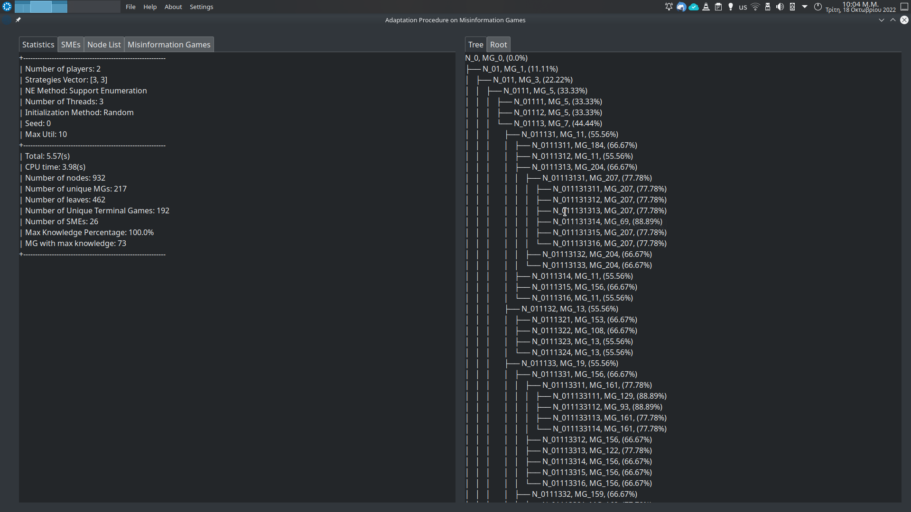

# Implementation of the Adaptation Procedure on Misinformation Games v2

An implementation of the adaptation procedure on misinformation games, in Python 3. For the details regarding the theory and algorithm behind this implementation, see the included paper (see ./documentation/SETN_final_named.pdf). We strongly recommend to read the paper first.

In this *second* version of the program, we added the following features (see related sections bellow):

1. Parallelism via Multithreading.
2. Various Approximation Methods, for reducing the Rounding Error.
3. A Graphical User Interface

## LICENSE
Shield: [![CC BY-NC-SA 4.0][cc-by-nc-sa-shield]][cc-by-nc-sa]

This work is licensed under a
[Creative Commons Attribution-NonCommercial-ShareAlike 4.0 International License][cc-by-nc-sa].

[![CC BY-NC-SA 4.0][cc-by-nc-sa-image]][cc-by-nc-sa]

[cc-by-nc-sa]: http://creativecommons.org/licenses/by-nc-sa/4.0/
[cc-by-nc-sa-image]: https://licensebuttons.net/l/by-nc-sa/4.0/88x31.png
[cc-by-nc-sa-shield]: https://img.shields.io/badge/License-CC%20BY--NC--SA%204.0-lightgrey.svg

## Installation

The installation process takes three steps. The first is installing the Python3 Programming Language and the related packages. The second step regards the installation of the two *subsystems* used by the python code (as subprocesses), the CLINGO language and the GAMBIT package. The third step is installing the necessary third party python libraries. The installation instructions where written for the Ubuntu 22.04 OS, but should be similar for any Linux distribution. The *Windows OS is currently unsupported*. The installation on windows should follow the similar steps, but some extra configuration may be needed. Also, for the program to run on Windows *some (minor) changes in the program's code may be necessary*, e.g. changing the directory separator from `/` to `\`.

### Python

Here we give the instructions of installing the latest Python 3 release and the Package Installer for Python (PIP). Naturally a Python interpreter is necessary for the execution of the program's code. On the other hand, PIP allows the easy installation of the necessary third party libraries. The installation of Jupyter Notebook, is optional, since the program can be executed without it. We use Jupyter only for *presentation* purposes, in order to run the `./source/2x2_exam.ipynb` file. This file contains an elegant and user-friendly presentation of the program's execution on a simple 2x2 misinformation game.

#### Python 3

The Python 3 language comes pre-installed in Ubuntu 22.04. Nevertheless, if for some reason isn't available on your system you can install it with,

`sudo apt install python3`

**Note:** Currently the version 3.8.10 is the latest stable release of Python 3, available in the Ubuntu repository. Note that the latest  version available in Ubuntu repository falls a bit behind the latest version released for Windows. This should not pose a problem.

#### PIP

You can install the Package Installer for Python (PIP) with the following command.

`sudo apt install python3-pip`

#### jupyter notebook (optional)

You can install the Jupyter Notebook with the following comand

`sudo apt install jupyter-notebook`

#### Alias (optional)

For convenience we use the command `python` instead of the `python3`. You can create an alias for the `python3` command, with

`alias python=python3`

Otherwise, use the `python3` command instead of `python`, in the listings bellow.

### Subsystems

There are two subsystems that our program utilises, the [CLINGO Answer Set Programming Language](https://potassco.org/clingo/) and the GAMBIT package for computations on Normal Form Games.

#### CLINGO

Firstly, we give the instructions to install the CLINGO language for Answer Set Programming. You can install CLINGO in Ubuntu with the following command,

`sudo apt install gringo`

After a successful installation the command `clingo` should be available on your command line prompt.

#### GAMBIT

The installation of the GAMBIT is a bit more elaborate than CLINGO, since it's not available on Ubuntu repository. The latest version of GAMBIT for linux is available [here](https://sourceforge.net/projects/gambit/files/gambit16/16.0.2/). We will use GAMBIT 16 here. GAMBIT 15 *isn't* supported in modern systems, as many of the C++ commands it uses are now deprecated. Please install the suggested version. The GAMBIT is released for Linux as a simple `.tar.gz` file. After downloading the compressed file, extract it, either by the desktop environment (recommended), or using the command,

```bash
tar –xvzf gambit-16.0.2.tar.gz
```

Let `./gambit-16.0.2` be the directory the above compressed file is extracted. `cd` to this directory. The installation follows three simple steps, i.e. `./configure`, `make`, `sudo make install`. If the compiling tools `make` and `g++` *aren't* available on your system you can install them by typing, `sudo apt install make` and `sudo apt install g++` respectively. After, installing the necessary tool, you can proceed with the installation, typing sequentially.

```bash
$ ./configure
$ make
$ sudo make install
```

The `make` command will throw a few *warnings*. This will not be a problem if no *errors* are thrown. If the `sudo make install` command is executed successfully, then the installation should be completed. If the installation is successful, then the command `gambit-gnm` should be available. Open *any* directory on terminal and type the command `gambit-gnm`. You should get the following:


Type `Ctrl+D` or `Ctrl+C` to exit the prompt. The `gambit-gnm` is the *only* GAMBIT command used by our application.

**Notes:** If the `make` command is completed successfully the GAMBIT commands are accessible locally, by providing a path to the GAMBIT's directory. With `sudo make install` the commands are made available *globally*. If something goes wrong with the `make` command, use `make clean` and retry.

### Third Party Python Libraries

Now we will install the following third party python libraries that are used from our application. We install all the libraries using `pip`.

1. `termcolor` a library that prints colourful text on terminal.
   * Install with `pip install termcolor`.
2. `anytree` a library that implements a generic tree structure.
   * Install with `pip install anytree`.
3. `numpy` a library for linear algebra matrices manipulation.
   * Install with `pip install numpy`.

### Test the Installation

With the installation of the third party python libraries the installation of the application should be concluded. We provide two methods to check if everything is working. The first method is to run a simple experiment, the second regards the jupyter notebook, *and it's valid only if you installed the (optional) jupyter notebook (see above)*.

#### Run an experiment

An easy way to see if everything went right is to go to the `./source` directory and type

`python do_experiments.py 1 1`. 

You should get the following,


The `do_experiment.py` runs a selection of experiments and outputs the generated statistics. The command `python do_experiments.py 1 1` runs only the first experiment and outputs the statistics on the standard output. We will discuss the `do_experiment.py` file in more detail in a following Section.

#### Run the jupyter notebook

If you have installed the jupyter notebook you can run the example in `./source/2x2_exam.ipynb`. Simply, go to the `./source` directory and type,

`jupyter-notebook`

The browser will open, with a catalogue of the `./source` files. Select the `2x2_exam.ipynb`. The example should be loaded. If you want, you can *clear the kernel* and *run all the cells*.

### Installation Notes

The above installation process was tested on a *fresh* Ubuntu 20.04.4 installation, on a virtual machine.

## How to execute the code

There are two ways to execute the program, the user can either provide a `.mg` file as input (see the Input subsection, below), or specify some parameters in order to generate a random instance. In either cases the execution takes place in `./source` directory.

1. **Input from file:**

   `python main.py -f <path_to_input_file>`

   For example, you may run the input file provided, `python main.py -f ../input_data/2x2_mg_example.mg`. The provided input file should follow the `.mg` file format, see below.

2. **Random generation:**

   `python main.py -r <num_players> <strat_1> <strat_2> ... <strat_n> <max_util>`

   Where, `<num_players>` is the number of players, `<strat_1> <strat_2> ... <strat_n>` are the number of strategies for each player, and `<max_util>` is the maximum utility. For example, `python -r 2 2 2 10` will generate a random 2x2 misinformation, where the utilities are in set {0, 1, 2, ..., 10}.

The user should provide either `-f <input_file>`, or `-r <params>` as arguments. Otherwise, an error message will be outputed.

### Arguments

The arguments `-f <input_file>` and `-r <params>` are the only mandatory parameters. Additionally, a few other options are provided.

* `-f` Initialise from file. E.g.: `-f <mg_file_path>`.
* `-r` Generate random root file. E.g.: `-r <num_players> <strat_1> <strat_2> ... <strat_n> <max_util>`.
* `-se` Initialise the seed for the random generation. E.g. `-se 0`. *The default value is* `0`.
* `-t` Print the Adaptation Tree (in text, on terminal).
* `-ro` Print the root on the terminal. Useful, when the root file is randomly generated.
* `-st` Save the Adaptation Tree in file. E.g.: `-st <path_to_output.txt>`.
* `-l` Print a catalogue of the leaf nodes of the Adaptation Tree.
* `-n` Print all the nodes of the Adaptation Tree.
* `-m` Print the unique misinformation games.
* `-sm` Save the unique misinformation games under a directory. E.g.: `-sm <dir_path>`.
* `-ss` Save the stable set (terminal set in the paper), the unique .mg files, under a directory. E.g.: `-ss <dir_path>`.
* `-sr` Save the root to file. E.g.: `-sr <path_to_output.mg>`.
* `-h` Help. Prints the list of arguments.
* `-q` Quiet. Suppresses the "about" header.
* `-no` Suppresses *all* output. Useful for the experiments.
* `-fm` Fast mode. See paper. Implements a *faster* algorithm. While not the default hard coded operation mode, *it is highly recommended*. Otherwise, a (much) slower, naive method is executed.
* `-mtt` Multi-thread Traversal. See section about Parallelism. E.g. `-mtt <number_of_threads>` specifies the number of threads to be used in the Adaptation Procedure. *Only available in fast mode*, i.e. the `-fm` argument must also be provided.
* `-nem` Nash Equilibrium Method. Specifies the method to be used for finding Nash equilibria. E.g. `-nem xpe` for [Extreme Point Enumeration](https://gambitproject.readthedocs.io/en/latest/tools.html#gambit-enummixed-enumerate-equilibria-in-a-two-player-game). The supported methods also include: gnm ([Generalized Newton Method](https://gambitproject.readthedocs.io/en/latest/tools.html#gambit-gnm-compute-nash-equilibria-in-a-strategic-game-using-a-global-newton-method)), enp ([Enumerate Pure Equilibria](https://gambitproject.readthedocs.io/en/latest/tools.html#gambit-enumpure-enumerate-pure-strategy-equilibria-of-a-game)), pol ([Support Enumeration](https://gambitproject.readthedocs.io/en/latest/tools.html#gambit-enumpoly-compute-equilibria-of-a-game-using-polynomial-systems-of-equations)). The default method is `pol`, i.e. Support Enumeration. Note that the method `xpe` is available *only* in 2-player games.
* `-dmn` Domain. See the related section about Rounding Errors and Numerical Domains. Thus we specify the domain in which the strategy profiles of the GAMBIT will be mapped to.  E.g. `-dmn d 8`, for using 8 decimals points. The supported methods are `-dmn r` (for real), for an arbitrary number of decimal points (using the GAMBIT's defaults), and `-dmn v` (for voronoi), for a more elaborate method using Voronoi diagrams. The "voronoi method" is explained in the *Rounding Errors and Numerical Domains* section.
* `-dbg` Debugging. See the related Debugging section. This arguments just provides additional information about the programs execution. It can be used along with two optional arguments. `-dbg p` will print *warning* messages, if some error occur. `-dbg d` will terminate the programs execution after the appearance of the first error. Of course, the two additional arguments can be combined, i.e. `-dbg p d`.

**Note:** We strongly suggest to always use the arguments `-mtt 4 -fm`, if your system has *at least* 4 hardware threads. 

### Input

Consider the following `.mg` file `./input_data/2x2_mg_example.mg`.

```python
# 2x2_mg_example.mg
# number of players
2

# strategies
2 2

# game 0 utilities
1 -1
-1 1
-1 1
1 -1

# game 1: row player game
2 2
3 0
0 3
1 1

# game 2: column player game
2 1
0 0
0 0
1 2
```

The `.mg` file should respect the following syntax.

#### Comments

The lines starting with `#` are comments and are discarded, by the program.

**Note:** The comments should be ***alone*** in a line. For example, `2 # number of players` will provoke an error.

#### Number of players

The *first* non-commended, non-empty line should be the number of players. In the above example we have 2 players.

#### Strategies vector

The second non-commended, non-empty line should contain the strategies vector, i.e. `<s1> <s2>  ... <sn>`, where `<si>` is the number of strategies of the i-th player, and `n` is the number of players given above. The number of strategies of each player is separated by *spaces* `' '`.

#### Normal form games (Utilities dictionaries)

The `.mg` file should contain `n + 1`  utilities dictionaries, which encode `n + 1` normal form games. The first dictionary (the "0-th" game) is regarded as the *actual* (or objective) game. The i-th game is the subjective game of the i-th player. Each line contains a single payoff vector, the j-th number is the payoff of the j-th player. The sequence that the payoff vectors are written is fixed and follows the sequence that GAMBIT enumerates the strategy profiles (see [here](https://gambitproject.readthedocs.io/en/latest/formats.html#structure-of-the-body-list-of-payoffs)). The enumeration of the strategy profiles follows an "reverse" lexicographical order, e.g. `(1, 1), (2, 1), (1, 2), (2, 2)`. Consider the first normal form game of the above file.

```python
# game 0 utilities
1 -1
-1 1
-1 1
1 -1
```

The first line corresponds to the strategy profile `(1, 1)`, where both players play their first strategy, and player 1 gets `1` unit of utility, while player 2 gets `-1` unit of utility. The second line corresponds to the strategy profile `(2, 1)`, where the player 1 plays her second strategy, while player 2 plays her first strategy. Player 1 loses 1 unit of utility, while player 2 gains one. Etc.

### Output

Depending on the command line arguments the output will differ. The arguments that produce some output are the following:

1.  `-t` Outputs the Adaptation Tree in text based "graphics".
2. `-ro` Prints the root file. Useful, when the root file is randomly generated.
3.  `-l` Prints the leaf nodes of the Adaptation Tree.
4.  `-n` Prints the Adaptation Tree nodes.
5.  `-m` Prints the unique misinformation games

We will give examples for every case and explain the difference of the outputs in fast and slow modes. In every case, we use the example file `./input_data/2x2_mg_example.mg`.

#### Output without arguments

Firstly, we consider the output without arguments, apart the necessary arguments for input (i.e. `-r` or `-f`). This kind of output will be *always* printed, except when the argument `-no`, for "no output", is given. 

##### Slow mode

When we type the command `python main.py -f ../input_data/2x2_mg_example.mg` we get the following.

```python
$ ~/Έ/Ι/M/I/source> python main.py -f ../input_data/2x2_mg_example.mg 
Misinformation Games Adaptation Procedure
Version 1.2
Author: Merkouris Papamichail
Email: mercoyris@ics.forth.gr
Copyright FORTH 2022

# Progress Uniq MGs: 6/16
        ## Stable Set ##
MG_3: ((2, 1), (2, 2))
MG_5: ((1, 1), (1, 2), (2, 1), (2, 2))
MG_4: ((1, 1), (2, 1), (2, 2))
MG_1: ((2, 1),)

        ## Stable Misinformed Equilibria ##
{((0.0, 1.0), (1.0, 0.0)), ((0.5, 0.5), (0.5, 0.5))}

        ## Statistics ##
+---------------------------------------
| Number of players: 2
| Strategies Vector: [2, 2]
+---------------------------------------
| Total: 0.19683361053466797(s)
| CPU time: 0.06513542500000001(s)
| Number of nodes: 26
| Number of unique MGs: 6
| Number of leaves: 17
| Number of Unique Stable Games: 4
| Number of SMEs: 2
+---------------------------------------
```

The header consists of some information about this program. The next section describes the "stable" set (a more accurate term would be *trerminal set*, see paper) of the misinformation games, that were generated during the adaptation procedure. The "stable" set consists of the misinformation games that *produce themselves*, i.e. $mG \in \mathcal{AD}^1(mG)$. For each such misinformation game, we give the *set* of *position vectors* that where updated in order to produce this misinformation game. For example, for the misinformation game `MG_3` we would have,
$$
MG_3 = ((MG_0)_{(2, 1)})_{(2,2)}
$$
where `MG_0` is the *root* misinformation game. The next section presents the *Stable Misinformed Equilibria* of the root misinformation game. Lastly, we output some statistics about the performance. The `Total` entry regard the *total* time consumed by the program *including* the time consumed by the subsystems, CLINGO and GAMBIT. The `CPU time` entry includes the time consumed *only* by the python code, excluding the subsystems. Observe that the python code consumes only 1/3 of the total time. The two subsystems, and especially GAMBIT, consist the bottleneck of the computation.

##### Fast mode

We make some remarks regarding the fast mode. Consider the following statistics, on the same input in fast mode.

```python
        ## Statistics ##
+---------------------------------------
| Number of players: 2
| Strategies Vector: [2, 2]
+---------------------------------------
| Total: 0.16100573539733887(s)
| CPU time: 0.06466456699999999(s)
| Number of nodes: 16
| Number of unique MGs: 6
| Number of leaves: 9
| Number of Unique Stable Games: 4
| Number of SMEs: 2
+---------------------------------------
```

Observe that the numbers of unique misinformation games, SMEs, and unique stable games is unchanged. On the other hand, the number of leaves and the number of nodes changes. Fast mode saves a lot of iterations by "cleverly" omitting some nodes of the Adaptation Tree, without lose of information.

#### Adaptation Tree

The Adaptation Tree is printed with the argument `-t`. Observe in the figures bellow that the trees are different in slow and fast mode. the information that is encoded remains the same. Observe that if $T_{012}$ be the subtree under the node `N_012`, and $T_{021}$ be the subtree under the node `N_021`, we have $T_{012} \approx T_{021}$; the two subtrees are *isomorphic*. Hence, we may omit the second occurrence of the "same" subtree (see fast mode). It is important to note that the Graph Isomorphism Problem (GIP) is not computable in polynomial time ([see here for the complexity of GIP](https://en.wikipedia.org/wiki/Graph_isomorphism_problem)). Nevertheless, we can decide in constant time $Ο(1)$ if a subtree is isomorphic to another subtree, due to the *unique key* of a misinformation game. The *unique key*  consists of the *set of position vectors that have been changed from the root misinformation game* (see paper for $G_{set}$ and the data structure `mg_pool`).

##### Slow mode

```python
N_0, MG_0
├── N_01, MG_1
│   ├── N_011, MG_1
│   └── N_012, MG_3
│       ├── N_0121, MG_4
│       │   ├── N_01211, MG_4
│       │   ├── N_01212, MG_5
│       │   │   ├── N_012121, MG_5
│       │   │   ├── N_012122, MG_5
│       │   │   ├── N_012123, MG_5
│       │   │   └── N_012124, MG_5
│       │   ├── N_01213, MG_4
│       │   └── N_01214, MG_4
│       └── N_0122, MG_3
└── N_02, MG_2
    └── N_021, MG_3
        ├── N_0211, MG_4
        │   ├── N_02111, MG_4
        │   ├── N_02112, MG_5
        │   │   ├── N_021121, MG_5
        │   │   ├── N_021122, MG_5
        │   │   ├── N_021123, MG_5
        │   │   └── N_021124, MG_5
        │   ├── N_02113, MG_4
        │   └── N_02114, MG_4
        └── N_0212, MG_3
```

##### Fast mode

```python
N_0, MG_0
├── N_01, MG_1
│   ├── N_011, MG_1
│   └── N_012, MG_3
│       ├── N_0121, MG_4
│       │   ├── N_01211, MG_4
│       │   ├── N_01212, MG_5
│       │   │   ├── N_012121, MG_5
│       │   │   ├── N_012122, MG_5
│       │   │   ├── N_012123, MG_5
│       │   │   └── N_012124, MG_5
│       │   ├── N_01213, MG_4
│       │   └── N_01214, MG_4
│       └── N_0122, MG_3
└── N_02, MG_2
    └── N_021, MG_3
```

#### Leaves

The application can print a catalogue of the leaf nodes with the argument `-l`. Note that each node of the adaptation tree contains a label (or *pointer*, see Wikipedia [here](https://en.wikipedia.org/wiki/Pointer_(computer_programming))). Two nodes may have a label to the *same* misinformation game.

```python
        ## Leaves ##
| Node Name: N_012, MG_1
| Unique MG id: 1
| Previous NMEs Path: [(2, 1), (2, 1)]
| Unique Key: ((2, 1),)

| Node Name: N_0112, MG_3
| Unique MG id: 3
| Previous NMEs Path: [(2, 1), (2, 2), (2, 1)]
| Unique Key: ((2, 1), (2, 2))

	[...]
```

The record printed with the argument `-l` contains the entries:

1. `Node Name`, an identifier for the node and an identifier for the misinformation game this node "points" to.
2. `Unique MG id`, the label to the misinformation game.
3. `Previous NMEs Path`, the *sequence of position vector* that have been changed from the root misinformation game.
4. `Unique Key`, the unique key, which consists of the position vectors in the `Previous NMEs Path`, after we *sort* and remove the duplicates. While the `Previous NMEs Path` encodes a *sequence* of changes, the `Unique Key` encodes a *set*. Observe that, the update of the positions $v_1, v_2$ from the root misinformation game, is *identical* with the upadate of the position vectors $v_2, v_1$. Therefore, we can easily decide if two misinformation games are equivalent by checking their `Unique Keys`.

#### Root

The application can print the root file to the terminal with the argument `-ro`. The output also includes some comments, regarding some metadata of the misinformation game. This argument may be useful, when the application is initialised randomly.

```python
        ## Root ##
# Misinformation Game: 0
# NMEs: dict_keys([((0.0, 1.0), (1.0, 0.0))])
# SMEs: set()
# num players
2

# strategies
2 2 

# Game id: 0
# Nash Equilibria: [((1.0, 0.0), (0.0, 1.0))]
6 6 
0 4 
8 7 
6 4

 	[...]
```

#### Nodes

The application can print a catalogue of the nodes with the argument `-n`.

```python
        ## Nodes ##
| Node Name: N_0, MG_0
| Unique MG id: 0
| Previous NMEs Path: []
| Unique Key: ()

| Node Name: N_01, MG_1
| Unique MG id: 1
| Previous NMEs Path: [(2, 1)]
| Unique Key: ((2, 1),)

	[...]
```

Each record of this catalogue consists *of the same entries* as the records of the leaf nodes catalogue.

#### Unique misinformation games

The application can print a catalogue of the (unique) misinformation games with the argument `-m`.

```python
        ## MG Pool ##
| MG id: 0
| NMEs list: dict_keys([((0.0, 1.0), (1.0, 0.0)), ((0.0, 1.0), (0.0, 1.0)), ((0.0, 1.0), (0.333333, 0.666667))])
| Posistion Vectors: dict_values([[(2, 1)], [(2, 2)], [(2, 1), (2, 2)]])
| SMEs: set()
| Unique Key: ()

| MG id: 1
| NMEs list: dict_keys([((0.0, 1.0), (0.25, 0.75)), ((0.0, 1.0), (1.0, 0.0)), ((0.0, 1.0), (0.0, 1.0))])
| Posistion Vectors: dict_values([[(2, 1), (2, 2)], [(2, 1)], [(2, 2)]])
| SMEs: {((0.0, 1.0), (1.0, 0.0))}
| Unique Key: ((2, 1),)

	[...]
```

Each record of this catalogue consists of the following entries:

1. `MG id`, a unique id for each misinformation game.

2. `NMEs list`, the list of the Natural Misinformed Equilibria (NME). An implementation of the function $NME(mG)$, (see paper).

3. `Position Vectors`, a list of the corresponding position vectors to the above NMEs. An implementation of the function $\chi(NME(mG))$, i.e.
   $$
   \chi(NME(mG)) = \bigcup_{\sigma \in NME(mG)} \chi(\sigma)
   $$

4. `SMEs`, the *"direct"* stable misinformaed equilibria of this misinformation game. An implementation of the function $SME(mG)$.

5. `Unique Key`, the unique key of the misinformation game. See `Unique Key` entry in the `-l` (print leaves) command above.

#### Quiet & No output

We also provide commands to suppress some (`-q`), or all  (`-no`) of the output. 

##### Quiet

The quiet command forces a *"terminal friendly"* interface, that can be utilised from some parser script. Namely, the quiet command suppresses the "about" header of the output, while also suppresses the *"progress bar"*  (e.g. the message `# Progress Uniq MGs: 6/16`), and the colours. This "mode" is useful when someone wants to process the output of our application with some other program. Forces all the output to be in simple ASCII text, while discards all the unnecessary messages. Observe that we *keep* the headers of each section of the results. Each section of the results, begins with the character `#`. This can be utilised from a parser in order to distinguish each section of data.


At the figure above we observe difference between a "vanilla" execution of the  `2x2_mg_example.mg` example file (left), and the execution of the same file with the `-q` argument (right).

##### No output

On the other hand, the `-no` argument suppresses *all* output. It is designed to provide a *"experiment friendly"* interface. Note that the `-no` argument, *doesn't suppress*  the "progress bar" (`# Progress Uniq MGs: 6/16`). This is useful for experiments on big instances, where the execution may take several minutes, or hours. Of course, the two arguments can be given together, i.e. `-q -no`. We give an example of the usage of `-no` bellow.


Because the output of the progress bar is overwritten, it is not visible in the above figure. 

## Run Experiments

Experiments can be run with the `do_experiment.py` script.

```
python do_experiment.py <exp_1> <exp_2> (optional) <file_out>
```

Takes three arguments, the last of which is optional. The first two arguments are numbers in the range `{0, 1, ..., 7}`, and denote the experiments that will be run. E.g. for `python do_experiment.py 0 3` will run the experiments 0 through 3. The experiments are the following:

* `0` 2x2 misinformation game
* `1` 2x3 misinformation game
* `2` 3x3 misinformation game
* `3` 4x3 misinformation game
* `4` 4x4 misinformation game
* `5` 2x2x2 misinformation game
* `6` 3x2x2 misinformation game
* `7` 2x2x2x2 misinformation game

For each experiment, five games are randomly generated, with seeds the five first prime numbers, i.e. `2, 3, 5, 7, 11`, and utilities in the range `{0, 1, 2, ..., 10}`. For each experiment we discard the first and the last game, and take the average for the remaining three (see the relative Section in paper).

**Note:**

* Only the *first six* (0-5) experiments are "feasible" and terminate in reasonable time (which can take up to a few hours).
* Another important thing to note is that the experiments are *deterministic* in some sense, since the seed of the random number generator is fixed for each experiment.

## Code Documentation

Here we give the outline of the code along with some extensive documentation on the important classes and functions. It is *highly recommended*  to first read the attached paper (see ./documentation/SETN_final_named.pdf) and especially the section regarding the implementation, before proceeding to this documentation. This way the user will already have a high-level idea of how the implementation works. In this section we focus on the details of the implementation.

The source code of this project is located in the directory ./source and includes the following files:

#### The Main Body of the Application

1. **main.py:** A Python 3 file. The "main function" (or root file) of the program. Its function is only to collect the command line arguments and direct them to the Application class, located at application.pl.
2. **gui_main.py:** A Python 3 file. The "main function" (or root file) of the *Graphical User Interface* (GUI). The core functionality of the GUI is implemented in gtk_graphical_user_interface.py.
3. **application.py:** A Python 3 file. Its function is to *handle* the command line arguments and make the correct calls to the methods of the AdaptationProcedure class located at adaptation_procedure.py. It functions as an intermediate layer between the user and the AdaptationProcedure.
4. **gtk_graphical_user_interface.py:** A Python 3 file, using GTK 3.0. It implements the GUI, the style of the windows, menus, etc. We used the python interface for the GTK 3.0 library.
5. **application_process.py:** A Python 3 file. Its function is to handle the *communication* between the GUI and the command line application. Recall, that the interface for the command line application is implemented in application.py.
6. **adaptation_procedure.py:** A Python 3 file. It contains the AdaptationProcedure class which implements the adaptation procedure on a given misinformation game.
7. **misinformation_game.py:** A Python 3 file. It contains the MisinformationGame class which encodes a misinformation game as a list of n + 1 normal form games, where n is the number of players.
8. **game.py:**  A Python 3 file. It contains the NormalFormGame class which encodes a normal form game, as a dictionary from the strategy profiles, to payoff vectors.
9. **clingo.py:** A Python 3 file. It contains only a single function the `addaptation_step()`. It handles the communication between the python code and the CLINGO language. It uses the CLINGO file adaptation.lp.
10. **adaptation.lp:** A CLINGO file. It contains the rules (or *predicates*) that implement the *update operation* on a misinformation game.
11. **misinformation_game.lp:** A CLINGO file. It contains some auxiliary predicates for the adaptation.lp.
12. **gambit.py:** A Python 3 file. It contains a single function the `support()`. It handles the communication between the python code and the GAMBIT package.
13. **parsers.py:** A Python 3 file. It contains two functions that . parses the output of the GAMBIT package.
14. **params_vector.py:** A Python 3 file. Implements the ParamsVector class, which is used in the communication between the GUI and the command line application. An instance of the ParamsVector class keeps the *input* to the command line application. The class instance will keep the parameters that specify the behavior of the adaptation procedure. The parameters have been collected from the GUI, and passed to the command line application as (plain) text.
15. **data_vector.py:** A Python 3 file. Implements the DataVector class, which is used in the communication between the GUI and the command line application. An instance of the DataVector class keeps the *output* of the command line application to be send to the GUI, in order to be presented graphically.
16. **domain.py:** A Python 3 file. Implements the SPDomain class, which implements the domain mapping (see relative section in the sequel). This class implements an *experimental* feature that aims to deal with the numerical (rounding) error that may appear in the GAMBIT's output data.
17. **debugging.py:** A Python 3 file. Implements the Debugging class. This class collects measurements about the programs execution and provides a monitoring  inteface. This class is responsible for the additional information provided when the command line application is called using the `-dbg` argument.
18. **auxiliary_functions.py:** A Python 3 file. It contains some helper functions, that are used throughout the program.

#### Additional Helper Scripts and Tools

1. **generate_random_clingo_mg.py:** A Python 3 file. A script that generates (randomly) a CLINGO file that describes a misinformation game.

#### Experiments & Demos

1. **2x2_exam.ipynb:** A Jupyter Notebook file. A presentation of the execution of a 2x2 example.
2. **do_experiment.py:** A Python 3 file. It executes 8 experiments on the program and outputs some statistics. The user can specify which of the experiments to run.
3. **compare_methods.py:** A Python 3 file. A script that compare different GAMBIT methods.

### Normal Form Games

A Normal Form Game (NFG) is encoded in the `NormalFormGame` class, located in the `./source/game.py` file. 

#### Data Members

The data members of the function are given in the following figure.

```python
class NormalFormGame:
    ## Prelimineries
    gambit_pac			# The GAMBIT method to be used, for computing
    					# the Nash equilibria.
    
    debugging			# An instance of the Debugging class that keeps
    					# various metrics regarding the performance of
        				# the program.
    
    domain				# An instance of the SPDomain class that specifies
    					# the behavior of the program regarding floating
        				# point arithmetic.
    
	## Data Members
    game_id				# String, the id of the NFG
    
    num_players			# Integer, the number of players
    
    strategies			# [Int], the strategies vector of the players
    					# the number of strategies for each player
    
    utilities			# Dict: (Int) --> [Int], a dictionary from the
    					# strategy profiles, to the payments vector
	
    nash_equilibria		# [(Int)], a list of tuples, ecoding the Nash
    					# Equilibria of the game
    
    support				# Dict: Int --> [Int], a dictionary from a player,
    					# to her support strategies
 	
    # States
    strategy_profiles_generated		# Bool
    utilities_filled				# Bool
    nash_equilibria_computed		# Bool
    support_computed				# Bool
```

The boolean data members in the above figure are used to keep truck of the preconditions and the state of the class's instance. The states ensure that the instance of the class follows a predetermined transition between the states, in order to ensure the correctness of each method. All the states are initialised in `False`.

#### Methods

We now describe the significant methods of this class in detail.

##### Constructor

```python
def __init__(self, gambit_pac, debugging, domain, game_id = "", num_pl = 0, strategies = []):
```

The first three arguments of the constructor can be viewed as specifying our *computational environment*. The other three arguments specify the game id, the number of players, and the strategies vector. The later parameters have default arguments. Nevertheless, these default arguments are for technical purposes, it is advised, all the parameters to be given.

##### Generate strategy profiles

```python
def generate_strategy_profiles(self):
```

Generates the strategy profiles. Initialises the the *keys* of the `utilities` dictionary. For the values of this dictionary is used the empty utilities vector `[]`.

**Precondition:** `strategy_profiles_generated == False`

**Postcondition:** `strategy_profiles_generated == True`

##### Generate random utilities

The *first* of the three ways to fill the utilities of a NFG.

```python
def generate_random_utilities(self, max_utility):
```

Generates random utilities, given that the strategy profiles are, already, generated. It takes a single argument, without a default value. The utilities will be generated in the range `{0, 1, ..., max_utility}`.

**Precondition:** `strategy_profiles_generated == True and utilities_filled == False`

**Postcondition:** `utilities_filled == True`

**Note** that this method does not edit the `seed` of the random number generator.

##### Utilities form list

The *second* of the three ways to fill the utilities of a NFG.

```python
def utilities_from_list(self, util_info_list):
```

Fills the utilities of the NFG, given a utilities information list `util_info_list`. The utilities information list should have the following format.

`[[Game, Player, (Int), Util]]`

`util_info_list` is a list of lists, where inner list encodes an entry of the utilities dictionary. All the entries, i.e. `Game`, `Player`, `Util` are integers, while the tuple of integers `(Int)` encodes a strategy profile. Namely, an inner list of the form `[Game, Player, SP, Util]` encodes an instance, where player `Player` in the NFG `Game` and the strategy profile `SP` gets `Util` units of utility. This method is used from the `MisinofrmationGame` class, and the method `utilities_from_clingo()` (see the section Misinformation Game bellow). Note that the entry `Game` is discarted from the `NormalFormGame` class and is only used from the parent `MisinformationGame` class.

**Precondition:** `strategy_profiles_generated == True and utilities_filled == False`

**Postcondition:** `utilities_filled == True`

##### Utilities from string

The last method to fill the utilities.

```python
def utilities_from_str(self, lines):
```

The above function is used for filling the utilities from a list of strings. This function is used by the *grand*-parent class `AdaptationProcedure`, when initialising the root misinformation game, from a file. Namely, for our standard example `2x2_mg_example.mg` and for the actual `0` game, we would pass this function as argument the following,

```python
["1 -1",
"-1 1",
"-1 1",
"1 -1"]
```

**Precondition:** `strategy_profiles_generated == True and utilities_filled == False`

**Postcondition:** `utilities_filled == True`

##### Compute Nash equilibria

```py
def compute_nash_equilibria(self):
```

Computes the Nash equilibria of the normal form game, using the GAMBIT package. It is here, where we use the `gambit_pac` attribute. We also use the `debugging` attribute to measure the time consumed by GAMBIT and `domain` to rectify GAMBIT's output (if needed) in order to avoid rounding errors.

**Precondition:** `strategy_profiles_generated == True and utilities_filled == True and nash_equilibria_computed == False`

**Postcondition:** `nash_equilibria_computed == True`

##### Compute support

```python
def compute_support(self):
```

After computing the Nash equilibria we use this method to compute the *support* of the Nash equilibrium strategy profiles. With this function, the computation of a NFG is completed.

**Precondition:** `strategy_profiles_generated == True and utilities_filled == True and nash_equilibria_computed == True support_computed == False`

**Postcondition:** `support_computed == True`

##### Convert to CLINGO file

```python
def clingo_str_file(self):
	str_file =  self.str_vline("%")						# a commend line "%%%%%%%"
	str_file += self.str_header("%", "\n")				# some commented metadata
	str_file += self.str_vline("%")			+ "\n"		# a commend line "%%%%%%%"
	str_file += self.clingo_str_utility()	+ "\n"		# the utilities predicate
		
	return str_file
```

Converts the NFG to a description "readable" from the CLINGO programming language. For example the actual `0` game of the `2x2_mg_exam.mg` would be translated in the following predicates.

```matlab
%%%%%%%%%%%%%%%%%%%%%%%%%%%%%%%%%%%%%%%%%%
% Game Id: 0
% Number of Players: 2
% Strategies: [2, 2]
%%%%%%%%%%%%%%%%%%%%%%%%%%%%%%%%%%%%%%%%%%

u(0, 1, sp(1, sp(1, nul)), 1).
u(0, 2, sp(1, sp(1, nul)), -1).

	[...]
```

The information regarding the utilities is provided by the `u/4` predicate. The predicate `u(0, 1, sp(1, sp(1, nul)), 1)` states the fact that in game `0`, player `1` gets 1 unit of utility, in the strategy profile `(1,1)`. We encode a strategy profile with a finite list of the form `sp(1, sp(1, nul))`, where we use the symbolic functions `sp/2`, and `nul/0`.

##### Convert to GAMBIT file

```python
def gambit_str_file(self):
    output = self.__gambit_str_prologue() + self.__gambit_str_body()
		
	return output
```

Outputs the NFG in the `.nfg` format that can be read by GAMBIT. See [here](https://gambitproject.readthedocs.io/en/latest/formats.html#the-strategic-game-nfg-file-format-payoff-version) for the `.nfg` file format. It is important to note that the utilities are printed in a flat, comma separated list. *The "reverse" lexicographical order that GAMBIT uses, is used throughout the application*, when *printing* or *reading* strategy profiles and utilities.

#### Example

We now give a minimal working example, for using this class as a stand alone module.

```python
import game

# Prelimineries
import gambit
import debugging
import domain

gambit_pac = gambit.Gambit()
debugging = debugging.Debugging()
domain = domain.SPDomain()

id = "game_0"
num_players = 2
stategies = [2, 2]

NFG = game.NormalFormGame(gambit_pac, debugging, domain, id, num_players, strategies)

NFG.generate_strategy_profiles()

max_utilities = 10
NFG.generate_random_utilities(max_utilities)
```

In the above example, we create a Normal Form Game of two players, each of them having two strategies. We fill the utilities randomly in range `{0, 1, 2, ..., 10}`.

### Misinformation Games

A Misinformation Game (MG) is encoded in the `MisinformationGame` class, located in the `./source/misinformationgame.py` file.  A misinformation game is encoded as a list of normal form games.

#### Data members

The data members of the function are given in the following figure.

```python
class MisinformationGame:
	# Prelimineries
    gambit_pac			# The GAMBIT method to be used, for computing
    					# the Nash equilibria.
    
    debugging			# An instance of the Debugging class that keeps
    					# various metrics regarding the performance of
        				# the program.
    
    domain				# An instance of the SPDomain class that specifies
    					# the behavior of the program regarding floating
        				# point arithmetic.
    
    # Data Members
    game_id			# Str, an identifier of the MG
    num_players		# Int, the number of players
    strategies		# [Int], the strategies vector
    
    games			# [NormalFormGame], a list of normal form games. If n
    				# the number of players, we would have n + 1
        			# misinformation games.
        			# The 0-th game is the actual (objective) game,
                	# while the other n are the subjective games of
                    # the players.
    
    nme				# Dict: NMEs --> PositionVectors. A dictionary
    				# from a NME to the corresponding position vectors.
   	
    sme				# set(NMEs), the *set* of the NMEs of the game,
    				# that are Stable Misinformed Equilibria.
    
    clingo_format	# The clingo format of the MG
    
    nme_clingo		# Dict:NME --> [PosVec], a dictionary from a NME
    				# to the corresponding *predicates* of position
        			# vectors. The values would have the form,
        			# ["pos(<SP1>).", "pos(<SP2>).", .., "pos(<SPm>)."].
   
	# States
    utilities_generated		# Bool
    nme_computed			# Bool
    pos_vec_compiled		# Bool
    clingo_format_compiled	# Bool
    nmes_clingo_compiled	# Bool
```

The boolean data members in the above figure are used to keep track of the preconditions and the state of the class's instance. The states ensure that the instance of the class follows a predetermined transition between the states, in order to ensure the correctness of each method. All the states are initialised in `False`.

#### Methods

##### Constructor

```python
def __init__(self, gambit_pac, debugging, domain, game_id, num_players, strategies):
```

The first three arguments of the constructor can be viewed as specifying our *computational environment*. The `gambit_pac`, `debugging` and `domain` instances are passed directly to the NormalFormGame subclasses. The other three arguments, `game_id`, `num_players`, and `strategies`, specify the instance behavior. Note that, the arguments are *identical* to those of a `NormalFormGame` instance. The `game_id` is a string. The `num_players` is an integer, while the `strategies` is a list of integers describing the strategies vector.

The constructor, call the constructor of all the n + 1 NFGs and generates their strategy profiles, i.e. the method `NormalformGame::generate_strategy_profiles()` is called. Hence the state variable `NFG.strategy_profiles_generated` is `True` for each of the n + 1 NFG.

##### Generate random utilities

One of the two ways to fill the utilities.

```python
def generate_random_utilities(self, max_utility):
```

Generates random utilities for the every strategy profile, and every player. It iteratively calls the method `NormalFormGame::generate_random_utilities(max_utility)`.

**Precondition:** `utilities_generated == False`

**Postcondition:** `utilities_generated == True`

**Note** that this method does not edit the `seed` of the random number generator.

##### Utilities from CLINGO

The second and last method to fill the utilities

```python
def utilities_from_clingo(self, answer_set):
```

Computes the utilities of the Answer Set of CLINGO. The `answer_set` is passed as a simple string. This method calls the `NormalFormGame::utilities_from_list()` of the NFGs.

**Precondition:** `utilities_generated == False`

**Postcondition:** `utilities_generated == True`

**Note** that *there is no method to initialize the utilities from file*. This is because of technical reasons. The class `AdaptationProcedure` which initialises an instance of a MG from the above mentioned `.mg` file format. This is achieve with direct calls to the grand-child's method `NormalFormGame::utilities_from_str()`.  In deed this is not an elegant design and prevents the easy usage of the `MisinformationGame` as stand alone class.

##### Compute agents' social knowledge form the answer set

```python
def compute_knowledge_from_answer_set(self, answer_set):
```

When the utilities are initialized from the CLINGO answer set this method is invoked automatically. It parses the information existing in the answer set regarding the agents' social knowledge in this misinformation game. For a more in depth analysis of the notion of *knowledge* in misinformation games see the related section titled Agents' Knowledge.

##### Compute the NMEs

```python
def compute_nme_dict(self):
```

Computes the NMEs of the misinformation game. Calls the method `NormalFormGame::compute_support()`, *despite the fact* that only uses the Nash Equilibria generated from the `compute_support()` method. Note that the NMEs are mixed strategy profiles. This method initialises the dictionary `nme` (see Data Members). The key values of this dictionary are the NMEs generated, while the values are set to the empty list `[]`.

**Precondition:** `nme_computed == False`

**Postcondition:** `nme_computed == True`

**Note:** Since this function calls the `NormalFormGame::compute_support()`, this parent function *implicitly* calls the GAMBIT subsystem. For each call of `MisinformationGame::compute_nme_dict()`, there are n + 1 calls to `NormalFormGame::compute_support()`, hence n + 1 calls to GAMBIT.

**Issues:** See issues section, regarding the design of this method. No (known) issues in functionality.

##### Compute Position Vectors

```python
def compute_pos_vecs(self):
```

From the NMEs computes the position vectors, and fills the `nme` dictionary. Note that a NME is a *vector of vectors*. For some NME $\sigma$ computes the position vectors $\chi(\sigma)$.

**Precondition:** `nme_computed == True and pos_vec_computed == False`

**Postcondition:** `pos_vec_computed == True`

##### Compile CLINGO format

```python
def clingo_compile_format(self):
```

Compiles (computes) the description of the MG in CLINGO predicates. Calls the method `NormalFormGame::clingo_str_file()` in order to produce this description.

**Precondition:** `utilities_generated == True and clingo_format_compiled == False`

**Postcondition:** `clingo_format_compiled == True`

**Notes:** The child function `NormalFormGame::clingo_str_file()`, with the predicates for the utilities, also generates some comments regarding the metadata of the NFG. These comments are useful, when the child method is used stand alone, but unnecessary when the exported file is only read by CLINGO.

##### Compile predicates for position vectors

```python
def clingo_compile_nme(self):
```

This function computes a list of *predicates* of position vectors corresponding to NMEs. The name is somewhat unfortunate. If `(1, 2, 3)` some position vector, the we would have the predicate,

`pos(sp(1, sp(2, sp(3, nul))))`.

**Precondition:** `nme_computed == True and pos_vecs_computed == True and nmes_clingo_compiled == False`

**Postcondition:** `nmes_clingo_compiled == True`

**Issues:** See issues section. Unfortunate name. No known issues regarding the functionality.

##### Check if the initialization is completed

```python
def initialization_completed(self):
	return 	self.utilities_generated == True and\
			self.nme_computed == True and\
			self.pos_vecs_computed == True and\
			self.clingo_format_compiled	== True and\
			self.nmes_clingo_compiled == True
```

The above predicate check whether the initialisation of the class is completed.

##### Note

The list `sme` is not filled by methods of this class. This data member is handled by the `AdaptationProcedure` class.

#### Example

We now give a minimal working example, for using this class as a stand alone module.

```python
import misinformation_game as mg

# Prelimineries
import gambit
import debugging
import domain

gambit_pac = gambit.Gambit()
debugging = debugging.Debugging()
domain = domain.SPDomain()

id = "mg_0"
num_players = 2
strategies = [2, 2]

MG = mg.MisinformationGame(gambit_pac, debugging, domain, id, num_players, strategies)

max_utility = 10
MG.generate_random_utilities(max_utility)

MG.compute_nme_dict()
MG.compute_pos_vecs()
MG.clingo_compile_format()
MG.clingo_compile_nme()
```

In the above example we create a misinformation game `MG`, with `id = "mg_0"`, `num_players = 1` and strategies vector `strategies = [2, 2]`. Next we generate the utilities randomly, in the range `{0, 1, 2, ..., 10}`. Lastly, we fill all the data structures and the data members of the class.

### Adaptation Procedure

The file `adaptation_procedure.py` includes two classes the `AdaptationNode` and the `AdaptationProcedure`. This module implements two algorithms for the Adaptation Procedure, the naive "slow" mode, and the more elaborate "fast" mode.

#### Data Members

We present the data members of the class `AdaptationNode` first.

```python
class AdaptationNode(NodeMixin):	# expands the class NodeMixin
    								 # used by the anytree module
	
    # Data Members
    node_id					# Str, an identifier
    name					# Str, some identifier, used by NodeMixin.
    parent					# Pointer to the parent AdaptationNode
    						# (used by NodeMixin)
    misinformation_game		# Pointer to a misinformation game
    nme_path				# a list of *position vectors*
    unique_key				# a tuple encoding a set of the
    						# position vectors* that have been updated
   
	# Flags
    changed_from_parent		# Bool, a flag encoding whether *this*
    						# MG have been changed from the parent MG.
    new_mg					# Bool, a flag encoding whether this MG
    						# was generated for this node, or we
        					# encondered an already visited 
            				# misinformation game.
```

The module `anytree` and especially the class `NodeMixin` are used in order to render the (text based) graphics for the Adaptation Tree. The documentation for this *third party* library can be found [here](https://anytree.readthedocs.io/en/latest/).

Next, we present the data members of the `AdaptationProcedure` class.

```python
class AdaptationProcedure:
    # Prelimineries
    gambit_pac			# The GAMBIT method to be used, for computing
    					# the Nash equilibria.
    
    debugging			# An instance of the Debugging class that keeps
    					# various metrics regarding the performance of
        				# the program.
    
    domain				# An instance of the SPDomain class that specifies
    					# the behavior of the program regarding floating
        				# point arithmetic.
	
    # Data Members
    mis_game_pool		# Dict: unique_keys --> MGs, a dictionary from
    					# the unique keys, see above, to the corresponding
        				# Misinformation Game.
   
   uniq_mg_counter		# Int, just a counter that (well) counts the unique
    					# misinformation games. Note that we would have,
        				# uniq_mg_counter = |mis_game_pool.values()|
   
	mis_game_lock		# A threading.Lock that controls the access to the
    					# mis_game_pool. We use this lock for threads
        				# synchronization.
   
	queue				# [AdaptationNode], the BFS queue.
    queue_lock			# A threading.Lock that controls the access to the
    					# queue. We use this lock for threads
        				# synchronization.
    queue_empty			# A threading.Condition that uses queue_lock. We use
    					# this condition variable to wake the threads waiting
        				# the queue_lock.
    
    terminal_set		# set(MisinformationGame), in the paper we call this
    					# the *Terminal Set*. Are the MGs that produces themselves
        				# in a single step.
    terminal_set_lock	# A threading.Lock that controls the access to the
    					# terminal_set. We use this lock for threads
        				# synchronization.
    
    smes				# set((Int)), a set of tuples. The tuples correspond to
    					# the SMEs of the root MG.
    smes_lock			# A threading.Lock that controls the access to the
    					# smes. We use this lock for threads
        				# synchronization.
   	
    root				# MG, the root misinformation game
    
    node_list			# [AdaptationNode], just a record of the AdaptationNodes
    node_list_lock		# A threading.Lock that controls the access to the
    					# node_list. We use this lock for threads
        				# synchronization.
    
    
    # Statistics
    cpu_time			# Float, the time (in seconds) consumed by the python
    					# program, excluding the time consumed by the subsystems.
    
    total_time			# Float, the total time consumed by the application,
    					# *including* the time consumed by the subsystems.
    
    max_knowledge		# Int. the maximum knowlege the agents reached throughout
    					# the adaptation procedure
    max_knowledge_mg_id	# String. the Id of the misinformation game where the
    					# agents reach the maximum knowledge.
    
    # Multithreading
    tasks				# Int. the number of *pending* tasks, Each time a thread creates
        				# a new task, the value of the variable is increased. On the
            			# other hand, if a thread *consumes* (or serves) a task, the
                		# value of the variable is decreased. While there are still
                    	# pending taks (the adaptation procedure has not concluded)
                        # we have tasks > 0.
   	tasks_lock			# A threading.Lock that controls the access to the
    					# tasks. We use this lock for threads
        				# synchronization.
    pending_tasks		# A threading.Condition that uses tasks_lock. We use
    					# this condition variable to wake the threads waiting
        				# the tasks_lock.
    
    
    # States
    root_initialized				# Bool
    adaptatio_procedure_completed	# Bool
```

#### Methods

Since the `AdaptationNode` class is only used by the `AdapatationProcedure` class, and only contains *accessors* and *modifiers*, we only present the constructor of the `AdaptationNode` class, and then we proceed with most important methods of the `AdaptationProcedure` class.

##### Initialize an Adaptation Node

```python
def __init__(self, node_id, nme_path, unique_key, MG, parent = None, changed_from_parent = True, new_mg = True):
```

The adaptation node constructor takes as arguments the values for the data members of the class. The default values are only used when we construct the root Adaptation Node. Note that the two flags, `changed_from_parent` and `new_mg` are used from the method `AdapationProcedure::adaptation_substep()`, see bellow. Apart from the `root`, *each* node should have a parent. The data member `name` (see above) is filled by the fields `node_id` and the `MG.game_id`, respecting the following format, `self.name 	=  "N_" + node_id + ", MG_" + MG.get_game_id()`.

**Note:** There are *no* preconditions for creating an Adaptation Node. Perhaps an obvious precondition would be (and indeed was in an older version of the program), but we allow Adaptation Nodes to be constructed that reference Misinformation games where the utilities have *not* been computed yet. By doing this we achieve *full parallelization*  (see the related section titled Parallelism).

##### Initialize the Adaptation Procedure

```python
def __init__(
			self,
			gambit_pac,
			debugging,
			domain,
			num_mult_threads_traversal = 4,
			quiet = False,
			fast_mode = False
	)
```

Note that here (as we saw in the previously described classes) the computation environment is specified in the arguments `gambit_pac`, `debugging` and `domain`. We also provide the number of threads to be used, and flags for being or not in `fast_mode`, and printing or not the progress bar (i.e. `quiet`).

##### Root from file

The first of the two methods to initialise the adaptation procedure.

```python
def root_from_file(self, file_fmt):
```

The above method needs a single argument `file_fmt` which is the string of the `.mg` file format (see the Input section above). This methods uses *directly* the `NormalFormGame::utilities_from_str()` of the grand-child class.

**Precondition:** `root_initialized == False`

**Postcondition:** `root_initialized == True`

**Note:** In these initialisation methods, and the method `new_mis_game()` (see bellow), we call all the necessary methods to *completely* initialise the MG, i.e. we have `MG.initialization_completed() == True`.

##### Randomly generated root

The second method to initialise the adaptation procedure.

```python
def root_random(self, num_players, strategies, max_utility):
```

The above method needs three arguments, the `num_players` which is an integer denoting the number of players, the `strategies` a list of integers which denotes the strategies vector, and the `max_utility` an integer needed for the random number generator. This method utilises the `MisinformationGame::generate_random_utilities(max_utility)`, and generates the utilities in the range `{0, 1, 2, ..., max_utility}`.

**Precondition:** `root_initialized == False`

**Postcondition:** `root_initialized == True`

**Note:** In these initialization methods, and the method `new_mis_game()` (see below), we call all the necessary methods to *completely* initialize the MG, i.e. we have `MG.initialization_completed() == True`.

##### New misinformation game

```python
def _new_mis_game(self, parent, new_unique_key, pred_pos_vec):
```

Creates a new misinformation game and adds it to the `mg_pool` data structure. Takes three arguments. The first arguments `parent` is a "pointer" to a `AdaptationNode`, this pointer is only used to access the data members `num_players`, `strategies` etc. in order to initialise the MG. The second argument, `new_unique_key` is used to "save" the MG to the `mg_pool` dictionary. The `pred_pos_vec` is a CLINGO predicate, we use this predicate to invoke the CLINGO subsystem and apply the *update operation* (see paper). From the CLINGO subsystem we obtain the answer set containing the utilities for the new misinformation game. 

**Notes:**

* This is the only method (apart from the root initialisation) where the counter `uniq_mg_counter` is increased, `self.uniq_mg_counter += 1`.
* This is the only method of the Adaptation Procedure class, where we make GAMBIT and CLINGO calls.

##### Adaptation substep

```python
def _adaptation_substep(self, node_id, parent, tuple_pos_vec, changed_from_parent, pred_pos_vec):
```

This is perhaps *the most important* method of the `AdaptationProcedure` class. Takes five arguments. The first `node_id` is the id of the *child* node. The `parent` is the parent `AdaptationNode`. The third argument `tuple_pos_vec` is the *position vector* that will be updated from the parent to receive the child node. The fourth argument, `changed_from_parent` is quite self-explanatory; it denotes a boolean function that is `True` if and only if the resulting misinformation game has changed from its parent. The last argument, `pred_pos_vec` is the CLINGO-predicate of the position vector `tuple_pos_vec`. 

We have three cases:

**Case 1:** The child is a copy of its parent.

```python
if not changed_from_parent:
	parents_MG = parent.get_mg_pointer()
	return AdaptationNode(node_id, new_path, parents_unique_key, parents_MG, parent, False, False)
```

If the resulting misinformation game *will* not be different from its parent, we omit computing it. We just create a new Adaptation Node that *points* to the (already computed) parent misinformation game. Also, if the child is equal to its parent, then the NME corresponding to the position vector `tuple_pos_vec` is a *potential* SME. Thus, we differentiate this case from the next.

**Case 2:** The child differs from its parent, *but* equals to another misinformation game, computed in another branch of the Adaptation Tree.

```python
if self.mg_already_computed(new_unique_key):
		MG = self.mis_game_pool[new_unique_key]
		return AdaptationNode(node_id, new_path, new_unique_key, MG, parent, True, False)
```

In this case, we just check if the `new_unique_key` is already computed. Note that the `new_uniq_key` essentially is a (sorted) sequence of the pieces of information that the agents know at the moment. In other words, `new_uniq_key` encodes the set of position vectors that have resulted to this misinformation game; we sometimes refer to this structure as *"position vector history"*. The set of `uniq_keys` is *isomorphic* to the set of misinformation games. Hence, we can check if we have already computed the child, *without* computing the child. Namely, we claim the following equation holds.
$$
mG_1.\mathtt{position\_vec\_history()} = mG_2.\mathtt{position\_vec\_history()} \Leftrightarrow mG_1 = mG_2
$$
The details about *why* the above equation holds are provided in the section about Parallelism[^1]. 

In this case, again, we do not create a new misinformation game. On the other hand, we create just an Adaptation Node that *points* to the already existing misinformation game `mis_game_pool[new_uniq_key]`.

[^1]: We omitted the details here, please refer to the section about Parallelism for a detailed (while informal) "proof".

**Case 3:** We have a *new* misinformation game.

```python
new_MG = self._new_mis_game(parent, new_unique_key, pred_pos_vec)
return AdaptationNode(node_id, new_path, new_unique_key, new_MG, parent, True, True)
```

This is the *only* case, where we create a new misinformation game, and we do that only if we encounter a misinformation game for the first time. Observe that only in this case we call the method `AdaptationProcedure::new_mis_game()`.

##### Adaptation step

```python
def _adaptation_step(self, parent):
```

Given a parent node this method will compute a step of the Adaptation Procedure. Namely, given a parent node $mG$, with the NMEs and position vectors computed, we will apply the adaptation procedure on the parent, each time at the position designated by a position vector. We perform this computation in three steps:

1. **Create Requests:** We create tuples of the form:

   ```python
   (
   	request_parent,		# a pointer to the parent node
   	request_nme,		# the NME as tuple of real numbers
   	tuple_pos_vec,		# a pos. vec. corresponding to the NME,
   						# as tuple of integers
   	pred_pos_vec		# the pos. vec. as a clingo predicate
   )
   ```

   We use these requests to check wheather the resulting MG, when the update operation is applied, is a) different of its parent and b) to compute the new MG.

2. **Handle Requests:** In this step we invoke the `_adaptation_substep()` method. This method decides whether this branch will be stopped, i.e. the node will be added as leaf, and the child will *not* be added back to queue; or we will continue the adaptation procedure, in which case we add the child back to the queue.

3. **Compute SMEs** Using the `changed_from_parent` bit we decide whether the NME we take in consideration, is an SME. Recall that an NME is an SME is *all* the position vector that correspond to the NME do *not*  result in a new NME.

##### Adaptation procedure

```python
def adaptation_procedure(self):
```

This method just starts the working threads.

```python
for i in range(self.num_mult_threads_traversal): self.workers[i].start()
```

##### Traversal Thread Operate

```python
def traversal_thread_operate(self):
```

This is the *target* function of the threads. This method is essentially *"consumes"* an adaptation node from the queue, and applies the `adaptation_step()`. In this method takes place the core of the thread synchronization, using [locks](https://en.wikipedia.org/wiki/Lock_(computer_science)) and [condition variables](https://en.wikipedia.org/wiki/Monitor_(synchronization)#Condition_variables_2). For the thread handling we use the [threading python library](https://docs.python.org/3/library/threading.html), i.e. the [`threading.Lock()` object](https://docs.python.org/3/library/threading.html#lock-objects) and the [`threading.Condition()` object](https://docs.python.org/3/library/threading.html#lock-objects). The threads, while the variable `traversal_threading_operation_on` is `True` will try and acquire the `queue_lock` and consume an adaptation node. With this node as `parent` will call the `_adaptation_step()` method. Inside, the adaptation method, is new nodes are added in the queue, the `tasks` variable will be increased. On the other hand, inside the `traversal_thread_operate()` method the `tasks` variable will be decreased by `1`, since the thread achieved consuming a node. The tasks variable is essential for the threads synchronization, as we will see in the sequel.

##### Wait for results

```python
def wait_for_results(self):
```

This method is used by the Application class which calls the methods of the Adaptation Procedure class. It is used to make the Application wait for the Adaptation Procedure to be concluded. Due to the parallelism this is not a simple task. The queue of the adaptation procedure could be empty, *but* the Adaptation Procedure could not be concluded. In other words, assume that we have *at least* 2 threads, namely `T1` and `T2`. Also, assume that the `queue` has only one node (this of course is the case at the beginning of the procedure, when the queue only includes the root). Now, `T1` achieves to access the `queue` and consumes the node. On the other hand, `T2` will wait on the condition variable `queue_empty`, since the queue is now empty. On the other hand, there is still *useful* work to be done, namely `T1` will compute the children of the node and add the to the queue. In no case, we want the Adaptation Procedure to be stopped. We want the Application class to still wait for the results.

In order to achieve this, we use the `tasks` variable. The tasks variable contains the *correct* measurement regarding the existence of useful work to be done. In the above scenario we will have `tasks > 0`. Let the node that is handled by `T1` to have $n$ children. After concluding the `adaptation_step()`, `T1` will increase the number of tasks to be done to `tasks = tasks + n`. At the end of an iteration of the `traversal_thread_operate()`, and after the `tasks` variable is (potentially) increased, only then we decrease the tasks `tasks = tasks - 1`, since we consumed a node at the beginning of the iteration.

From the above, we hope to be obvious, that the application class should wait *while* `tasks > 0`. This is exactly, how we implement the `wait_for_results()` method:

```python
self.tasks_lock.acquire()
while self.tasks > 0:
	self.pending_tasks.wait()
self.tasks_lock.release()
		
self.adaptation_procedure_completed = True
```

##### Turn (the threads) off

```python
def turn_off(self):
```

After, the `wait_for_results()` method returns, the Application class calls the `turn_off()` method. Note that, when the queue is finally empty and we have no pending tasks, i.e. `tasks == 0`, all the threads will be waiting. Thus, the Application should turn them off. We do that by essentially setting the variable `traversal_threading_operation_on`  to `False`. Then, wake up the threads, in order for them to return. This is achieved by the following code (in `tunr_off()` method).

```python
self.traversal_threading_operation_on = False

self.queue_lock.acquire()
self.queue_empty.notify_all()
self.queue_lock.release()
```

On the other hand, from the code bellow (which resides in `traversal_threading_operate()`) the threads will return (exit):

```python
## If you woke from waiting, with an empty queue return
if self.queue == [] and not self.traversal_threading_operation_on:
	self.queue_lock.release()
	return
```

##### Notes

For more information about the way our parallel algorithm works, see the related section about Parallelism.

#### Examples

We give two minimal examples for the `AdaptationProcedure` class.

##### Input from file

The first example regards the initialisation of the root node from a file.

```python
import adaptation_procedure as ap
# Prelimineries
import gambit
import debugging
import domain

# Computation Enviroment
gambit_pac = gambit.Gambit()
debugging = debugging.Debugging()
domain = domain.SPDomain()

# Execution Parameters
num_mult_threads = 4
quiet = False
fast_mode = True

# Game Parameters (Open File)
f = open("../input_data/2x2_mg_example.mg", r)
file_fmt = f.read()
f.close()

# Create an empty Adaptation Procedure
adapt_proc = ap.AdaptationProcedure(
	gambit_pac,
    debugging,
    domain,
    num_mult_threads,
    quiet,
    fast_mode
)
# Initialize from File
adapt_proc.root_from_file(file_fmt)

adapt_proc.adaptation_procedure()			# run the procedure in parallel
adapt_proc.adapt_proc.wait_for_results()	# wait for the results
adapt_proc.adapt_proc.turn_off()			# terminate the threads
```

In the above example, we initialise the adaptation procedure from the file `./input_data/2x2_mg_example.mg`

##### Randomly generated root

The second example regards the random generation of the root adaptation node.

```python
import adaptation_procedure as ap
# Prelimineries
import gambit
import debugging
import domain

# Computation Enviroment
gambit_pac = gambit.Gambit()
debugging = debugging.Debugging()
domain = domain.SPDomain()

# Execution Parameters
num_mult_threads	= 4
quiet				= False
fast_mode			= True

# Game Parameters
num_players	= 2
strategies	= 2
max_util	= 10

# Create an empty Adaptation Procedure
adapt_proc = ap.AdaptationProcedure(
	gambit_pac,
    debugging,
    domain,
    num_mult_threads,
    quiet,
    fast_mode
)
# Initialize Randomly
adapt_proc.root_random(num_players, strategies, max_util)

adapt_proc.adaptation_procedure()			# run the procedure in parallel
adapt_proc.adapt_proc.wait_for_results()	# wait for the results
adapt_proc.adapt_proc.turn_off()			# terminate the threads
```

In the above example, we created a random 2x2 misinformation game, with the utility values in the range `{0, 1, ..., 10}`.

### Subsystems

The two subsystems are handled as *sub-processes* by the python's code. See [here](https://docs.python.org/3/library/subprocess.html), for more information regarding suprocesses in python.

#### CLINGO subsystem

The parameters for the spawn of the CLINGO subprocess are setted in the file `clingo.py`

```python
def addaptation_step(clingo_mg_file, clingo_nme, clingo_axioms="./adaptation.pl"):
```

This file contains a single function called `addaptation_step()` (misspelled).  This function takes three arguments. The first is a string containg the description of a misinformation game in predicates. The second argument, also a string, contains a single predicate which provides a position vector, i.e. `pos(<pos_vec>)`. The last argument is a CLINGO file containing the axioms (or rules) describing the update operation.

**Note:** We can determine the number of threads to make available for the CLINGO compiler. The default setting, we choose is 4.

```python
clingo_call = subprocess.run(
		[
			"clingo",
			"-t",
			"4"
		],
		stdout=subprocess.PIPE,
		text=True,
		input=input
	)
```

This can be changed by changing the value in line 5.

#### GAMBIT subsystem

The GAMBIT subsystem in defined in the `gambit.py` file. There, we define the `Gambit` class. The `Gambit` class is initialized as following.

```python
def __init__(self, decimal = 8, method_val = method_vals.pol_val, timeout = 1):
```

The first parameter defines the accuracy, i.e. the number of decimal points. The second parameter specifies the method used to compute the Nash equilibria. As the default method, we use the [Support Enumeration](https://gambitproject.readthedocs.io/en/latest/tools.html#gambit-enumpoly-compute-equilibria-of-a-game-using-polynomial-systems-of-equations), i.e. the `gambit-enumpoly` command. The last parameter specifies the timeout, i.e. the time interval we allow the GAMBIT command to run, before we terminate it. The default value used is 1 second. From the experiments we observed that this is a sufficient (enough) interval.

## Parallelism

The parallel version of the implementation can be invoked using the `-mtt <num_threads>` (where mtt stands for *"multi-threading traversal"*). The parallel implementation is *optimal* in the sense that, when `k` threads are given, then the code will run `k` *times faster*. We will try to establish this claim in the sequel.

**Notes:** Parallelism is available *only in fast mode*. When the argument `-mtt` is given without providing the argument `-fm`, an error message will be printed. The above constraint is due to the *structure*  of the parallel algorithm, *and cannot be lifted*. We will also establish this claim in the sequel.

### Serial Algorithm: A Theoretical Overview

It is important to understand in depth the purpose of our algorithm. Perhaps the pseudocode presented in the paper is somewhat *oversimplified*. Our algorithm *traverses* the adaptation graph, in order to compute the SMEs, *but* in order to do that, and guarantee that *all* the SMEs will be (eventually) discovered, we need to assert the following conditions:

1. Let $\mathcal{AD}^\infty(mG_0)$ be the set of all misinformation games that appear in an adaptation procedure on $mG_0$. We have to explore *the whole* $\mathcal{AD}^\infty(mG_0)$, namely to make sure that our algorithm doesn't omit *any* nodes of the adaptation graph.
2. Let $E_{mG}$ be the *adaptation relation* on $\mathcal{AD}^\infty(mG_0)$. Namely, for some $mG_1, mG_2 \in \mathcal{AD}^\infty(mG_0)$, such that there exists some position vector $\vec{v} \in \chi(NME(mG_1))$, with $mG_2 = (mG_1)_{\vec{v}}$, we have $(mG_1, mG_2) \in E_{mG}$. In other words, the relation $E_{mG}$ contains *all* the pairs of misinformation games $mG_1, mG_2$, such that we can arrive from $mG_1$ to $mG_2$ with a *single* update operation.

If we let, $V = \mathcal{AD}^\infty(mG_0), E = E_{mG}$ we have our adaptation graph $G = (V, E)$. On the other hand, in contrast to traditional graphic-theoretic settings, we don't know *a priori* the sets $V, E$.  On the contrary, we are given some method, e.g. `compute_children()` that given a misinformation games, computes its children. We will analyze in more detail the `compute_children()` method in the sequel. For now, let us write a version of the BFS method adjusted for our setting.

```
V <-- {}			// the set of vertices
E <-- {}			// the set of edges
Q <-- {root_mG}		// the BFS queue
while Q != {}:
	parent_mG <-- Q.pop()
	parent_mG.compute_children()
	for each child_mG in parent_mG.get_children():
		if child_mG not in V:
			V <-- V U {child_mG}
			Q,insert(child_mG)
		if (parent_mG, child_mG) not in E:
			E <-- E U {(parent_mG, child_mG)}
return G = (V, E)
```

For the above algorithm, we have that our aim is to *construct* the graph, rather than explore it. Also, note that in each step, we either discover a new *node* or a new *relation*. When we discover a new node, we always discover a new relation, the opposite does not necessarily hold. On the other hand, we insert *only new nodes* to the queue `Q`.

#### A More Detailed Approach

As we established in the paper, we can transfer all of the above notions, i.e. the adaptation graph, from the misinformation game setting to *position vector strings*. In other words, we can define an isomorphism from $\mathcal{AD}^\infty(mG_0)$ to a subset of *strings* of position vectors $\mathcal{U}^\star$[^1]. Namely, for a misinformation game $mG \in \mathcal{AD}^\infty(mG_0)$, we can define a method, e.g. `get_pos_history()`, which returns *the sequence of position vectors that have been updated from the root*, namely, *the pieces of information the agents learned* from the beginning of the procedure. In this direction, we change the definition of the symbol `V`, whose function is to keep the misinformation game we have computed, from a set, to a *dictionary*. Additionally, we change the definition of the symbol `E`, from a relation on misinformation games to a relation on position vector strings.

[^1]: In the paper we define explicitly this subset $V_{mG}$, of $\mathcal{U}^\star$.  We avoid here a formal definition to ease the discussion.

From the above we give a more detailed version of our algorithm.

```
Q <-- {root}	// BFS queue
V <-- {}		// the set of visited mGs
E <-- {}
while Q != {}:
	parent_mG <-- Q.pop()
	for each pos_vec in parent_mG.get_pos_vecs():
		if is_new_mg(parent_mg, pos_vec, parent_mG.get_pos_vec_history(), V):
			child_mG <-- update_operation(parent_mG, pos_vec)			// CLINGO call (expensive call)
			V[[pos_vec | parent_mG.get_pos_vec_history()]] = child_mG	// update the dictionary
			child_mG.compute_pos_vecs()									// GAMBIT call (very expensive call)
			E.insert((parent_mG, child_mG))
			Q.append(mG')
		else:
			child_mG <-- V[[pos_vec | parent_mG.get_pos_vec_history()]]
			E.insert((parent_mG, child_mG))
```

Observe, that we broke the computation of the children in two steps. At first we compute the position vectors of a misinformation game, with `compute_pos_vec()` method. This method essentially implements the composition of the functions $\chi()$ and $NME()$, i.e. $\chi(NME(mG))$. From a position vector we compute the *actual* misinformation game with the `update_operation()` method, which takes as argument a *parent* misinformation game and a position vector, and returns a new misinformation game. Lastly, with `[head|tail]` we denote a list with `head` as head and `tail` as tail.

An important thing to note is the existence of the `is_new_mg()` method. This method takes as argument a position vector (of the parent), the position vector history of the parent and the *dictionary* `V`, and checks weather the position vector sequence `[pos_vec | parent_mG.get_pos_vec_history()]` will result on a new misinformation game. How can we implement the `is_new_mg()` predicate? Observe that there are two cases. The first one is when the sequence of position vectors has already been computed, i.e. the key `[pos_vec | parent_mG.get_pos_vec_history()]` exist in the dictionary `V`. On the other hand, the sequence could not be already computed, but the update operation result in the same misinformation game, i.e. `update_operation(parent_mG.get_pos_vec_history(), pos_vec) = parent_mG`. This could happen because the piece of information denoted by `pos_vec` belongs to the *a priori* knowledge of the agents. Namely, the players have are correct about their payoffs in the strategy profile corresponding to `pos_vec`, *before the adaptation procedure begins*. We can reduce this second case to the first, by *preprocessing*.

##### Preprocessing

Before the adaptation procedure begins, but after the root misinformation game is initialized, we check *exhaustively* all the position vectors to test whether  the update operation on the root misinformation game, at the position vector, results in a changed misinformation game. If not, we add this misinformation game ad hoc to the roots `pos_vec_history`. The disadvantage of this approach is that, in order to perform this test, we need to make an expensive CLINGO call for each position vector. Let a $n$-player game, where the number of players' strategies  are denoted by $s_1, s_2, \dots, s_n$. Then, we would make $p = \prod_{i = 1}^{n} s_i$ CLINGO calls. On the other hand, this cost becomes *negligible*, with respect to the number of CLINGO calls we avoid during the adaptation procedure. See the following example.


In the above figure, we see the execution of the same instance, without (on the left) and with (on the right) preprocessing. The instance we executed is `python main.py -r 2 3 4 10 -fm -mtt 2 -dbg`, namely an instance of a 2-player misinformation game, with player 1 having 3 strategies, while player 2 has 4 strategies. The maximum utility had been set to 10. The random number generator used the default seed 0. From the above discussion, the preprocessing costs $3\cdot 4 = 12$ CLINGO calls. On the other hand, the preprocessing version, still manages to make 100 CLINGO calls less. 

### Towards Parallelism

The utilitarian motivation for implementing a parallel approach[^1]  is to make the expensive GAMBIT and CLINGO calls in parallel. Of course, our aim is for a fully parallelized approach, in order to take advantage of all the available resources of the machine. In other words, if `k` cores are available, we would like to make `k` GAMBIT calls in parallel. In this direction, we set the following goals.

[^1]: Apart from our ever present scientific curiosity.

#### Goals

1.  **Independent Execution** Each thread should be able to execute its `while-loop` *independently* of the other.
2.  **No Duplicate Computations.** One thread should not make computations that another thread is currently making.
3.  **No Waiting.** No thread should *wait* the other.

#### Problems

Observe that there is a trade of between (1) and (2, 3) of the above goals. The main problem appears when two threads are trying to access the same node. In general, this could happen quite often, since we can have *diamonds* in our graph (see paper). Observe the following figure.


Assume that thread `T1` reaches a node corresponding to the misinformation game $mG_1$, and thread `T2` reaches a node corresponding to $mG_2$. Here, we assume that $mG_1 \neq mG_2$. Let $mG_1$ to have a single position vector $\vec{v}_1$, while $mG_2$ to have the single position vector $\vec{v}_2$. On the other hand, we denote with $\mathtt{pos\_history}_1$ be the position vector history of $mG_1$, and similarly $\mathtt{pos\_history}_2$ be the position vector history of $mG_2$. Note that we would have $\mathtt{update\_operation}(\mathtt{pos\_history}_1, \vec{v}_{1}) = \mathtt{update\_operation}(\mathtt{pos\_history}_2, \vec{v}_{2}) = mG^\prime$. In this case, we want the update operation to be executed *only once*. We also have the same expectation for the method $\mathtt{compute\_pos\_vecs}()$. The first operation demands an expensive CLINGO call, while the later an even more expensive GAMBIT call.

We assume that the two threads work *independently* (see 1st goal). If we allow the two threads to be completely oblivious of the computations of the other, then the expensive $\mathtt{update\_operation}()$, and $\mathtt{compute\_pos\_vecs}()$ will happen twice. Thus we violate the 2nd goal, for *no duplicate computations*.  On the other hand, let us assume that the access to the dictionary `V` is protected by a *lock* (mutex). Also, assume that the tread `T1` succeeds to acquire the lock first. This way, `T1` will execute the `if` part of the `if-then-else` block, while thread `T2` will find that $mG^\prime$ has already computed, hence will execute the `else` part of the block. Therefore, we achieve the 2nd goal, i.e. `T2` will not make computations performed by `T1`. On the other hand, if `T1` releases the lock *after* completing the computations inside the `if` block, `T2` will spend valuable time waiting `T1` performing the expensive CLINGO and GAMBIT calls. Thus, the 3rd goal would have been violated. In our implementation we achieve *all 3 of the goals* we set.

#### The Solution

We present our solution in the following figure.


In the above example, we assume `T1` acquires the lock first. We allow `T1` to keep the lock only as long it takes to check if the sequence is already computed. If the sequence corresponds to a new misinformation game, then we just create an *empty* instance of a misinformation game node and store it *pointer* to the dictionary. Then, `T1` releases the lock. Now, `T2` access the share dictionary `V` and finds that the key `seq` already exists. Hence, the `is_new_mg()` check will fail, and the `else` block will be executed, just adding the appropriate edge. On the other hand, `T1` will continue its computations *in parallel*, computing the payoff matrices of the new misinformation game $mG^\prime$ and its position vectors. Thus, we achieve goals (1)-(3).

##### Regarding the Slow Mode

Perhaps it is obvious why this parallel method wouldn't work for the slow mode. In the slow mode `T2`, after inserting the correct edge, would continue to access the children of $mG^\prime$. This constitutes the key issue. The thread `T2` wouldn't be able to access the children of $mG^\prime$ because they *haven't been computed yet* by `T1`. On the other hand, the slow mode exists in our program for "historic" purposes and shouldn't be used, since it makes unnecessary computations.

## Rounding Errors & Numerical Domains

Another issue one (inevitably) faces when using real number arithmetic in computers is the *truncation* or *rounding* error. For example, how can we be sure that the strategy profiles ((0.001, 0.999), (0, 1)), ((0, 1), (0, 1)) are indeed two different Nash equilibria and not the same equilibrium printed twice, due to rounding errors. Unless we solve the misinformation game by hand it is quite difficult to reach a definite conclusion. Nevertheless, we provide some tools that can be utilized by the computer scientist or user, in order to control such errors.The `AdaptationProcedure` class takes as argument an instance of the `SPDomain` class located in file `domain.py`. This instance is then passed as argument to the constructor of the `MisinformationGame` and `NormalFormGame` classes. Essentially, the `SPDomain` class encodes a *mapping* from the GAMBIT's results to a user defined domain. Essentially, we could choose any mapping *preserving the strategy properties* of the strategy profile.

### The Theoretical Overview of the Problem

Observe the following figure.


Remember that if $\sigma =(s_1, s_2, \dots, s_n)$ is a *mixed strategy* of a player, then $s_i \geq 0$, for every $i \in [n]$ and $\sum_{i = 1}^n s_i = 1$. Let $\phi \colon [0, 1]^n \to [0, 1]^n$ be the mapping we chose. Then, if $\phi(\sigma) = (s_1^\prime, s_2^\prime, \dots, s_n^\prime)$, we want $s^\prime_i \geq 0$, $\sum_{i = 1}^n s^\prime_i = 1$, namely preserving the *strategy property*. For a strategy profile on $m$ players, we have $\phi(\sigma_1, \sigma_2, \dots, \sigma_m) = (\phi(\sigma_1), \phi(\sigma_2), \dots, \phi(\sigma_m))$. Observe that if a player has $n$ strategies, then we would have $2^n - 1$ possible sets of position vectors, namely the characteristic bit-vectors, of the positions of the strategies played with positive probability. Observe that this results in an equivalence class. For example, the equivalence class of the bit-vector $(1, 1, 0, 0, \dots, 0)$  contains all the valid mixed strategies that only their first two coordinates are positive, i.e. $(\frac{1}{2}, \frac{1}{2}, 0, \dots, 0)$, $(\frac{1}{3}, \frac{2}{3}, 0, \dots, 0)$,  $(\frac{3}{5}, \frac{2}{5}, 0, \dots, 0)$, etc. It's easy to see that all these equivalence classes are *infinite*. Now, from the above, our rounding error problem reduces to a *mis-identification* problem. Namely, the vector $(0.001, 0.999)$ should (probably) belong to the $(0, 1)$ class, instead it is assigned to the $(1, 1)$ class.

### A Possible Solution: Voronoi Diagrams & Classification

From each equivalence class, we can choose a "good" representative $r$. Then, we can choose an appropriate distance measure $\mu$. If $\mathcal{R}=\{r_1, \dots, r_k\}$ is our set of representatives, we compute the distances $\mu(r_1, \sigma), \mu(r_2, \sigma), \dots \mu(r_k, \sigma)$ for a mixed strategy $\sigma$. Then we classify the (possible erroneous) mixed strategy vector $\sigma$ to the equivalence class of whose representative is *closer* to $\sigma$. Let $\lambda$ be the number of "ones" in the bit-vector $b$ of the class, e.g. for the class $b = (1, 1, 0, \dots, 0)$, we have $\lambda = 2$. We can choose as representative the vector $\frac{1}{\lambda} b$, e.g. $(\frac{1}{2}, \frac{1}{2}, 0, \dots, 0)$ for our example. On the other hand, we can choose as measure $\mu$ the *Euclidean* distance. This situation is depicted on the above figure. This is called a [*Voronoi diagram*](https://en.m.wikipedia.org/wiki/Voronoi_diagram). We call the representatives we chose *seeds*. Each seed defines a bounded area, of the points in the plane that are closer to it, than any other seed, called a *cell*. In the $n$ dimensions these cells will be *convex polytopes*.

### Using the SPDomain Class

We can use the above functionality by adding the argument `-dmn <method>` to our terminal command. The supported methods are the following:

* `-dmn v` Voronoi. Where the method described above is used.
* `-dmn r` Real. Where the mapping $\phi()$ is the *identical* function, i.e. no change is made to the GAMBITs output.
* `-dmn d <number of digits>` Where the user can define the rate of accuracy by designating the number of decimal digits.

**Note:** When the `-dmn d <number of digits>` is used the `SPDomain` class is bypassed. The computation gets restricted to floating point numbers of `d` decimal digits by the GAMBIT subsystem. All the GAMBIT commands take as argument the number of decimal digits, hence we pass this argument directly to GAMBIT. Note that this restriction isn't enforced by truncation; on the other hand, GAMBIT returns mixed strategy vectors that respect the *mixed strategy property* defined above, i.e. the coordinates sum up to one. For example, let `(0.5714, 0.0, 0.4286)` be a mixed strategy returned by GAMBIT using 4 decimal digits[^1]. When we make the same call using 2 digits, the strategy profile returned would be `(0.57, 0.0, 0.43)`, where of course `0.57 + 0.43 = 1 = 0.5714 + 0.4286`.

[^1]: More precisely,  this mixed strategy is given as an SME strategy in the call `python main.py -r 2 3 4 10 -fm -mtt 2 -dmn d 4 -se 0`.

### Reviewing the Methods

Unfortunately, despite the elegant theory behind the Voronoi method, we didn't observe any measurable improvement in performance or accuracy using this method. We suggest using the simple `-dmn d <number of digits>`, with fewer decimal points if it seems that rounding errors exist. Perhaps more research is needed for the Voronoi method to surpass the traditional approaches.

## Debugging Class

The debugging class is used for presenting more extensive metrics regarding the performance of our programs execution. In the following listing we present the debugging report of the command `python main.py -r 2 3 4 10 -fm -dbg -se 0`, notice the argument `-dbg`.

```
        ## Statistics ##
+------------------------------------------------------------
| Number of players: 2
| Strategies Vector: [3, 4]
| NE Method: Support Enumeration
| Number of Threads: 1
| Initialization Method: Random
| Seed: 0
| Max Util: 10
+------------------------------------------------------------
| Total: 23.28(s)
| CPU time: 1.55(s)
| Number of nodes: 600
| Number of unique MGs: 154
| Number of leaves: 344
| Number of Unique Terminal Games: 136
| Number of SMEs: 10
| Max Knowledge Percentage: 77.08%
| MG with max knowledge: 64
+------------------------------------------------------------
| Total GAMBIT time: 21.16(s)
| Number of GAMBIT calls: 462
| Average time per GAMBIT call: 0.046(s)
| Total CLINGO time: 1.6(s)
| Number of CLINGO calls: 153
| Average time per CLINGO call: 0.01(s)
+------------------------------------------------------------
| GAMBIT time / Total Time %: 90.9%
| CLINGO time / Total Time %: 6.86%
| CPU time / Total Time %: 6.65%
+------------------------------------------------------------
| # Zeros Mixed Strategy: 0
| # Mixed Strategies \w sum <= 1: 9
| # No NE after GAMBIT call: 0
| Too many threads: False
+------------------------------------------------------------
```

Notice the various additional fields in the statistics section of the output. We keep separate metrics for total number of CLINGO and GAMBIT calls, the percentage of time consumed by each subsystem and number of some additional warning/errors. Regarding the later, we keep the number of zeros mixed strategy being returned as an equilibrium strategy by GAMBIT, namely the time a strategy of the form $(0, 0, \dots, 0)$ is returned as a strategy of a player in an equilibrium returned by GAMBIT. This is a significant error and we would like to avoid it completely; nevertheless it may some times occur. We also keep the number of times the *mixed strategy property* gets violated, i.e. we have a mixed strategy whose coordinates do not sum up to one. This is a minor issue and sometimes unavoidable, due to numerical errors in GAMBIT's methods. Another significant error that should never occur is for GAMBIT to not return *any* Nash equilibria. Naturally, we know from Nash's theorem that such an equilibrium *always* exist, although sometimes the GAMBIT cannot find it in the suggested time. Lastly, we keep a boolean variable testing if the number of threads designated by the users exceeds the number of hardware threads in this computer.

None of the above error should cause the program's execution to fail. On the other hand, if these error metrics are concernedly high, this could suggest that the results are not accurate.

### Additional Parameters

Additional parameter could be used along with the `-dbg` argument to further specify the programs behavior.

* `-dbg p` Print. This will print a message any time an error (or warning) is raised.
* `-dbg d` Die. This "kills" the program if an error is encountered.

By errors we mean the 4 cases mentioned above. When the argument `-dbg d` is provided, an error message will inform the user which error triggered the programs termination.

### Issues

When using multithreading, the percentage of the time consumed by each subsystem *is not* calculated correctly. Not our example, when using 2 threads, i.e. `python main.py -r 2 3 4 10 -fm -dbg -se 0 -mtt 2`.

```
        ## Statistics ##
+------------------------------------------------------------
| Number of players: 2
| Strategies Vector: [3, 4]
| NE Method: Support Enumeration
| Number of Threads: 2
| Initialization Method: Random
| Seed: 0
| Max Util: 10
+------------------------------------------------------------
| Total: 12.53(s)
| CPU time: 1.72(s)
| Number of nodes: 600
| Number of unique MGs: 154
| Number of leaves: 344
| Number of Unique Terminal Games: 136
| Number of SMEs: 10
| Max Knowledge Percentage: 77.08%
| MG with max knowledge: 47
+------------------------------------------------------------
| Total GAMBIT time: 22.4(s)
| Number of GAMBIT calls: 462
| Average time per GAMBIT call: 0.048(s)
| Total CLINGO time: 1.6(s)
| Number of CLINGO calls: 153
| Average time per CLINGO call: 0.01(s)
+------------------------------------------------------------
| GAMBIT time / Total Time %: 178.82%
| CLINGO time / Total Time %: 12.8%
| CPU time / Total Time %: 13.7%
+------------------------------------------------------------
| # Zeros Mixed Strategy: 0
| # Mixed Strategies \w sum <= 1: 9
| # No NE after GAMBIT call: 0
| Too many threads: False
+------------------------------------------------------------
```


## Graphical User Interface

We implemented a Graphical User Interface (GUI) for our program using GTK 3, more precisely the python gi library for GTK. The GUI can be invoked by running the `gui_main.py` file. After giving the `python gtk_graphical_user_interface.py` command in the terminal, the following window will appear.


The program will show an empty window with an additional dialog window. The dialog window will ask the user for an initialization method. As with the command line program, there are two initialization methods: initializing the adaptation procedure root from a file, or generating a random root, by providing some parameters.

### Initialization from File

Choosing the `File` option will open another dialog window which asks as to specify a `.mg` file:


### Generating a Random Root

On the other hand, choosing the `Random` option will result in the following dialog requesting the random generator parameters:


### Processing Input

When an initialization method is specified the program will proceed computing the results. Then a progress bar will appear showing a (not so accurate) estimation of the expected misinformation games to be computed.


The right hand number of the estimation is the number of all possible misinformation games that can appear throughout the adaptation procedure. In general, the misinformation games that will actually appear are fewer.

### Presenting Output

When the computation is concluded the program will output the results in plain text format.



Each tab of the left or right column will contain the corresponding section of the results.

### Settings

From the setting menu we can configure various execution parameters, like we would do with the corresponding command line arguments.


### Menus

The `File` menu provides many additional options for the user. From them we can save various sections (or all) of the results. To save all the files you can go to `Files > Save all`. Then a dialog window will be presented and ask for a directory; in this directory will be stored all the results of the adaptation procedure, as simple text files.

### Notes on the Architecture


The graphical user interface spawns a *process*[^1] the process executes the code of the file `application_process.py`. The process will communicate with the GUI using a [`multiprocessing.Queue`](https://docs.python.org/3/library/multiprocessing.html#multiprocessing.Queue), which is essentially a [pipe](https://en.wikipedia.org/wiki/Pipeline_(Unix)). The `application_process` spawns two threads, which we call `work_thread` and `msg_thread`. Both `work_thread` and `msg_thread` are "overlooking" the same code, namely the code inside the `application.py` file. In other works, using multiprocessing, the GUI invokes the command line application. Firstly, the GUI passes the arguments collected from the user, to the `application_proces` via the queue. Then the two threads take on. The `work_thread` essentially runs the adaptation procedure and waits to be concluded; then it will report the results to the GUI via the queue. On the other hand, the `msg_thread` monitors the progress of the adaptation procedure.  In regular intervals, it reports this progress to the GUI. Thus, the progress bar is implemented.

[^1]: See the module [`multiprocessing.Process`](https://docs.python.org/3/library/multiprocessing.html).

### Issues

As we established above, there are always $k + 2$ threads running in parallel, where $k$ is the number of hardware threads provided by the user. When $k+2$ *exceeds* the number of available hardware threads, then the *program crushes*.

## Agents' Knowledge

You might have observed that at the *tree* section of the results, there exists a percentage next to the node identifier. This denotes the *total knowledge* of the agents at this node. The total knowledge in calculated by CLINGO *automatically* when the subsystem is invoked to compute the update operation.

### Formal Definition

We give a formal definition of the *social*[^1] knowledge.  Let $mG$ be a misinformation game on $n$ players, and $P^0, P^1, \dots, P^n \in \mathbb{R}^{s_1 \times s_2 \times \cdots s_n}$ the $n$-dimensional payoff matrices, where $s_i, ~i \in [n]$ denotes the *number of strategies* of player $i$. With $P^i[\mathtt{pos\_vec}][j], ~i \geq 1, ~ j \in [n]$ we denote the *subjective* payment player $i$ *thinks* players $j$ will receive playing the strategy profile corresponding to $\mathtt{pos\_vec}$. On the other hand, with $P^0[\mathtt{pos\_vec}][j]$ we denote the *objective* payment of the player $j$ in the strategy profile corresponding to $\mathtt{pos\_vec}$. Let $\mathcal{P}$ be the set of *all valid position vectors*. Recall that $\vert\mathcal{P}\vert = p = \prod_{i=1}^n s_1$. Let $\mathtt{knowledge}(mG, i), ~ i \geq 1$ be the *knowledge of the player* $i$ in the misinformation game $mG$, we have,
$$
\mathtt{knowledge}(mG, i) = \# \{(\mathtt{pos\_vec}, j) \in \mathcal{P} \times [n] \mid P^0[\mathtt{pos\_vec}] = P^i[\mathtt{pos\_vec}] \}.
$$
Now for the social knowledge of all players is,
$$
\mathtt{knowledge}(mG) = \sum_{i = 1}^n \mathtt{knowledge}(mG, i).
$$
The total information that exists in the misinformation game, equals the number of pieces of knowledge the agents are able to acquire throughout the adaptation procedure. In other words, assume that each player $i$ knows all the pieces of information, i.e. the subjective view of player $i$ has been merged to the objective true. Namely, $P^0[\mathtt{pos\_vec}][j] = P^i[\mathtt{pos\_vec}][j]$, for each $\mathtt{pos\_vec} \in \mathcal{P}$ and each player $j \in [n]$. Hence,
$$
\mathtt{total\_information}(mG) = \sum_{i = 1}^n n \cdot p = n^2 \cdot p.
$$
Naturally, the fractional social knowledge is,
$$
\frac{\mathtt{knowledge(mG)}}{\mathtt{total\_information}(mG)}
$$


[^1]: See Social Welfare, some slides from AUEB [here](https://eclass.aueb.gr/modules/document/file.php/INF406/%CE%94%CE%B9%CE%B1%CE%BB%CE%AD%CE%BE%CE%B5%CE%B9%CF%82/AGT21-10-social-welfare.pdf). It is the *sum* of the utilities of the players in a given strategy profile.

### CLINGO predicates

In the CLINGO predicates we differentiate between *new* and *old* knowledge. The "new" knowledge refers to the agents' knowledge *after* the update operation, while the "old" knowledge refers to the agents' knowledge *before* the update operation. We define the following predicates:

* `new_knowlede/2`: denotes the $\mathtt{knowledge}(mG, i)$ function defined above, *after* the update operation.
* `new_knowledge/1`: denotes the $\mathtt{knowledge}(mG)$ function defined above, *after* the update operation.
* `old_knowledge/2`: denotes the $\mathtt{knowledge}(mG, i)$ function defined above, *before* the update operation.
* `old_knowledge/1`: denotes the $\mathtt{knowledge}(mG)$ function defined above, *before* the update operation.
* `total_knowledge/1`: denotes the $\mathtt{total\_information}(mG)$ function defined above. Note, that the total information is not depended on the update information.
* `new_frac_knowledge/2`: denotes the *fractional social knowledge* defined above, *after* the update operation.
* `old_frac_knowledge/2`: denotes the *fractional social knowledge* defined above, *before* the update operation.

Due to CLINGO being a logic programming language, we can transfer the above mathematical formulas *almost intact* to code. Hence, the predicate definitions, just follow the above mathematical definitions.

### Future Work: Finding a Single SME Efficiently

Using the agents' knowledge as [*potential*](https://en.wikipedia.org/wiki/Potential_method) (or [heuristic](https://en.wikipedia.org/wiki/Heuristic_(computer_science))) function we can find *efficiently* a single SME. In particular, instead of using a simple queue while traversing the adaptation graph, we can use a [*priority queue*](https://en.wikipedia.org/wiki/Priority_queue) and the knowledge of each misinformation game as value. Note that in each step of the adaptation procedure, the agent's *either acquire additional knowledge, or reach an SME*. Hence, with this method we can reach an SME in $O(\mathtt{total\_information}(mG_0))$ steps, where $mG_0$ is the root of the adaptation procedure. In other words, if the players reach 100% of the knowledge, then all the NMEs of the misinformation game are (inevitably) SMEs. Truing to increase the knowledge in each turn, we will reach faster to a point where the players' subjective views have been merge to the objective reality. On the other hand, there could be an SME, despite that the agents haven't discover the objective payoffs. Thus, this method being *heuristic*.

#### Theorem: Finding a Single SME in Linear GAMBIT calls

From the above discussion we have the following interesting theorem.

> A single SME can be found in *linear* GAMBIT calls,  to the size of the instance. Namely, in $O(p)$ time, having an oracle for $NASH$.

Of course, $NASH$ is a $PPAD$-complete problem, hence the overall complexity would still be exponential, unless $P = NP$. Note that finding all SMEs, using our algorithm, takes an *exponential number* of GAMBIT calls, i.e. an exponential time to an exponential subprocess.

### Notes on Agents' Knowledge

#### Stabilization Without Reaching the Objective Payoffs

The adaptation procedure may become stabilized, *without the agents reaching 100% of the games knowledge*. In other words, the agents' may reach an equilibrium without discovering all the pieces of information about the misinformation game. This happens when the player have no *incentive* to explore anymore.

#### Knowledge vs A Priori "History" (Preprocessing)

Recall that with preprocessing we try to capture the *a priori* knowledge of the players, namely the position vectors that will not result in any change after the update operation. Let $mG_0$ be the root of the adaptation procedure. Also let $mG_0.\mathtt{history}()$ be the set of position vectors that will not change the misinformation game. We may have an *empty* history, with non-zero initial knowledge. This is because the players may have some initial knowledge, e.g. in position vector $\vec{v}$ player $i$ knows the correct payoff *only* of herself, but there is not a single position vector. where *all* the players know the payoff of *all* the other players.

A way to develop some intuition about this situation, observe the different probabilities of the two events. Let $K$ be the event where the agents in an *uniformly randomly chosen* misinformation game have *non zero* knowledge. Also let $H$ be the event, where the uniformly randomly chosen misinformation game has non empty initial history. We will calculate the probabilities $P(H), P(K)$ and we will show that $P(K) \gg P(H)$. Let $n$ be the number of players. To ease the computations, let all the players having the same number of strategies $s$. Lastly, let the payoffs be integers in the range $\{0, 1, \dots, u\}$.

Firstly, we compute the probability $P(H)$. In order for the event to occur, we should have a position vector, which all the player agree upon. So the $n$ players and the actual game should agree upon the payments of player 1, the $n$ players and the actual game should agree upon the payoffs of player 2, etc. Hence,
$$
P(H) = \left(\frac{1}{u + 1}\right)^n \cdot \left(\frac{1}{u + 1}\right)^n \cdots \left(\frac{1}{u + 1}\right)^n = \left[ \left( \frac{1}{u + 1} \right)^{n}\right]^n = \left( \frac{1}{u + 1} \right)^{n^2}.
$$
For example, if $n = 2$ and $u = 10$, we have $P(H) = 0.000068301$[^1].

[^1]: Hence, we could omit the preprocessing, and with *high probability* we would not be wrong.

On the other hand, we see that the event $K$ will happen quite more often. Fix the payoff matrix of the actual game, and choose each payoff entry uniformly and independently, all the entries we choose should be different fro the actual payoffs. For example consider player 1. For her to have non zero initial knowledge, there should be (at least) one position vector, where she knows correctly the payoffs of (at least) one of the players. Let's call this event $K_1$. We would have,
$$
P(K_1) = \sum_{i = 1}^n \sum_{j = 1}^p \left( \frac{1}{u+1} \right) = n\cdot p \left( \frac{1}{u+1} \right) = n \cdot s^n \left( \frac{1}{u+1} \right)
$$
We see that $P(K) > P(K_1)$, but $P(K_1) \gg P(H)$. For example, if $s = 2$, $n = 2$, $u = 10$, we have $P(K) > P(K_1) = 0.72727$. Of course, if we keep $u$ constant and increase $s$ or $n$ then we would have non-zero initial knowledge with *probability one*[^2]!

[^2]: The author of this program had some error in the preprocessing routine, but still got correct results in comparison with a previous version of the program without preprocessing. Perhaps a take to home lesson is that a  wrong program can still give correct results.

**Notes:** Observe that the above analysis is based on the assumption that the misinformation games are generated by a uniform distribution. Of course, this assumption could as well be wrong for real world applications. On the other hand, it helps us to develop an intuition about the underlying phenomenon.

## Notes, Issues & Future Work

### Notes

1. The code has been developed for Ubuntu 20.04 LTS, and has also been tested in Ubuntu 22.04 LTS.
2. Python version 3.8.10
3. CLINGO version 5.4.0
4. GAMBIT version 16.0.2
5. anytree version 2.8.0
6. numpy version 1.22
7. termcolor version 1.1.0

### Issues & Code review

1. **[CR]** Absence of an *initialise form file* method in the `MisinformatioGame` class (see the note in Utilities from CLINGO section above).
2. **[CR]** The name of the `MisinformationGame::clingo_compile_nme()` method is somewhat unfortunate.
3. **[I]**  The `gambit-gnm` command *may* have some issues regarding *rounding errors*. For example, we could have the lines `NE, 0.98, 0.02, 0.9, 0.1`, and `NE, 1, 0, 1, 0` as separate Nash Equilibria.
4. **[I]** In `.mg` file, the "inline" comment, i.e. `0 2 3 # commentd` raises an error, where `0 2 3` are some data.
5. **[I]** The GUI doesn't look "pretty" in Ubuntu 22.04.  This is because the GTK method used to implement the menu is depricated.


### Future Work

1. Using the agents' knowledge as heuristic to compute a *single* SME in *linear* time (see the related subsection titled Future Work: Finding a Single SME in Linear GAMBIT calls).
2. There are APIs for both [CLINGO](https://potassco.org/clingo/python-api/5.4/) and [GAMBIT](https://gambitproject.readthedocs.io/en/latest/pyapi.html) for python. There wasn't a GAMBIT python interface while this project was in development. Perhaps, it would be beneficial if we integrate these two subsystems in the python code. Thus, we could simplify the architecture of the code. Also, this could make application faster.

## Apendix A: Regarding the implementation of dictionaries and sets on Python 3 and the GAMBIT input file format .nfg

### GAMBIT's .nfg file convention

We conclude this report with some remarks on the implementation of `dictioneries` and `sets` on Python 3. These remarks have to do with the sequence in which the Python 3 languages stores the entries of a `dictionary` or `set` internally. As we noted above, the GAMBIT package follows a particular convention regarding the order in which the utilities must be written in a `.nfg` file (see [here](https://gambitproject.readthedocs.io/en/latest/formats.html#the-strategic-game-nfg-file-format-payoff-version), GAMBIT's manual). We said above that the GAMBIT package follows a "reverse" lexicographical order. From GAMBIT's manual, we have the following,

~~~~
In general, the ordering of contingencies is done in the same way that we count: incrementing the least-significant digit place in the number first, and then incrementing more significant digit places in the number as the lower ones “roll over.” The only differences are that the counting starts with the digit 1, instead of 0, and that the “base” used for each digit is not 10, but instead is the number of strategies that player has in the game.
~~~~

An important thing to note is that *"the least significant digit"* above is the *leftmost* position. Hence the term "reverse lexicographical order". Note that if for example we have a list of tuples `L = [(1, 1), (2, 1), (1, 2), (2, 2)]`. The list `L` follows the GAMBIT's  convention. But, if we type `L.sort()` in Python 3, we would have, `L' = [(1, 1), (1, 2), (2, 1), (2, 2)]`. Observe that `L' != L`.

### Initialise a NFG in the Application

Now, lets follow the flow (or livespan) of a Normal Form Game data in our application. In the beginning, we either have a description of a NFG in the `.mg` input file (remember a MG is just a list of n + 1 NFG), or construct NFG randomly.

The initialisation of a NFG from a file is happening in the `NormalFormGame::utilities_from_str(lines)`. Note the part of the method bellow,

```python
for strategy_profiles in self.utilities.keys():
	line = ax.head(lines)
	line = line.split(" ")
	line = list(filter(lambda token: token != "", line))	# Discard empty tokens.
	int_line = list(map(int, line))
			
	self.utilities[strategy_profiles] = int_line
```

Observe that we *do not* check the sequence of the lines, we just "feed" the lines to the utilities dictionary, in a FCFS order. Additionally, the strategy profiles are generated in the method `NormalFormGame::generate_strategy_profiles()`,

```python
while current_strategy_profile < last_strategy_profile:
		strategy_profiles += [tuple(current_strategy_profile)]

		current_strategy_profile = ax.succ(current_strategy_profile, self.strategies.copy(), 1)
			
		
	## add the last_strategy_profile
	strategy_profiles += [tuple(current_strategy_profile)]
		
	self.utilities = {sp : dummy_utilities.copy() for sp in strategy_profiles}
```

Which uses the  function `succ` in `./source/auxiliary_function.py`,

```python
def succ(vector, base, curry):
	assert vector != [] or curry == 0, "auxiliary_functions.py: succ: Overflow!"
	
	if vector == []: return []
	
	v = head(vector)
	b = head(base)
	
	if curry == 0:	return [v]		+ vector
	if v + 1 < b:	return [v+1] 	+ succ(vector, base, 0)
	else:			return [0]		+ succ(vector, base, 1)
```

Note that `generate_strategy_profiles` just calls iteratively the `succ` function, which always increases the left most digit (or element of the `vector` list) that can be increased. *This respects the GAMBIT's convention of "reverse lexicographical order"*. **Hence, if the file follows the same convention, the internally representation of the NFG respects, the input file and the users input.** In other words, the program understands the same game that the user wants to write.

### Output a NFG to GAMBIT and CLINGO

After we initialised *correctly* the `utilities dictionary`, in many cases we need to convert it in other format, i.e. GAMBIT, of CLINGO, in order to do our computations. *Hence, we need to ensure that these conversions follow the same convention.*

#### GAMBIT

Let's first examine the Application --> GAMBIT communication. The utilities are printed in the method `NormalFormGame::__gambit_str_body()`, with a simple nested for-loop.

```python
def __gambit_str_body(self):
		
	output = ""
	for strategy_profile in self.utilities.keys():
		utilities = self.utilities[strategy_profile]
		for u in utilities:
			output += str(u) + " "
		
	return output
```

A *potential* problem would reside in the line 4, of the above listing, i.e. `for strategy_profile in self.utilities.keys():`. How we now that this for-loop iterates the strategy profiles in the correct order and follows the "reverse lexicographical order"? From the discussion on the [Stack Exchange](https://stackoverflow.com/questions/39980323/are-dictionaries-ordered-in-python-3-6), and the [official Python manual](https://docs.python.org/3/library/stdtypes.html?highlight=dict#mapping-types-dict), we have the following guarantee.

```
Dictionaries preserve insertion order. Note that updating a key does not affect the order. Keys added after deletion are inserted at the end.
[..]
Changed in version 3.7: Dictionary order is guaranteed to be insertion order. This behavior was an implementation detail of CPython from 3.6.
```

Hence, the have the *guarantee* that from Python 3.7 onward the `dictionary` *will*  preserve the insertion order. **Hence, the method `def __gambit_str_body(self):` is correct!**.

#### CLINGO

The Application --> CLINGO communication follows the same principle. The correctness of this conversion is *also based upon the preservation of the input order of the dictionary in Python*. The output to the CLINGO subsystem is implemented in the `NormalFormGame::__clingo_str_pl_utility()`, where,

```python
def __clingo_str_pl_utility(self, player):
	assert self.is_player(player)
		
	output = ""
	for strategy_profile in self.utilities.keys():
		output += self.__clingo_str_sp_pl_utility(strategy_profile, player)
		output += "\n"
		
	return output
```

The input from CLINGO is implemented in the `NormalFormGame::utilities_from_list(util_info_list)`, where the `utili_info_list` is constructed by the method `MisinformationGame::_answer_set_to_utilities_info_list(answer_set)`. The latter method just converts the information in the string `answer_set` to a list of tuples, that can be processed from `utilities_from_list()`. In the `utilities_from_list()` method we have,

```python
def utilities_from_list(self, util_info_list):
# Utilities Info List follows the format:
#	[[Game, Player, (Int), Util]],
#	Game, Player, Util are integers,
#	(Int) is a strategy profile, as
# 	a tuple of integers

#	[...]

	for util_info in util_info_list:
		(self.utilities[util_info[1]])[util_info[0]-1] = util_info[2]
```

Where we *already* have computed the strategy profiles. *Note* that we do not make any assumptions regarding the order of the CLINGO output. Hence, the method `utilities_from_list()` is correct.

## Appendix B: A comparison between Sets & Dictionaries in Python

Also, we would like to note that, in contrast to `dictioneries`, the `sets` ***do not** preserve the input order*. See the relative discussion on Stack Exchange [here](https://stackoverflow.com/questions/61414947/why-dont-python-sets-preserve-insertion-order). Additionally, similarly to dictionaries, the `set` structure is *unordered*. Hence, when we construct the `unique_key` (see Misinformation Games above), we use the following method, located in `./source/auxiliary_functions.py`.

```python
def path_to_set(path):
	
	if path == None:  return ()
	
	tmp = path.copy()
	tmp.sort()
	return  tuple(set(tmp))
```

See the [relative discussion](https://stackoverflow.com/questions/61414947/why-dont-python-sets-preserve-insertion-order) on why Python developers choose this design in the relative discussion in Stuck Exchange.

## Appendix C: Notes for developers coming from C++

### Simillar Data Structures in C++

Note that the `dictionary` in Python follows a different convention from similar structures in other languages, like C++. The similar structure `map` of C++ *orders* its entries. See C++ documentation [here](https://www.cplusplus.com/reference/map/map/). The same goes for the C++'s sets. In C++ the sets are ordered, in contrast to Python's sets which are regarded unordered (see Appendix B).

### Regarding Pointers

Despite the fact that one can not use [pointers](https://en.wikipedia.org/wiki/Pointer_(computer_programming)) explicitly, we can enforce the same behaviour *implicitly*. In a sense, all the variables in a Python script can be viewed as *pointers* or *references*. From the [relative discussion in Stack Exchange](https://stackoverflow.com/questions/13530998/are-python-variables-pointers-or-else-what-are-they), we have,

```
TLDR: Python names work like pointers with automatic de/referencing but do not allow explicit pointer operations. Other targets represent indirections, which behave similar to pointers
```

See also, another Stack Exchange thread about pointers and Python [here]().
